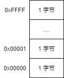
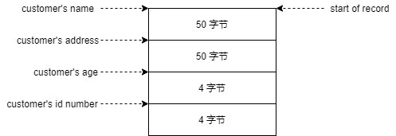
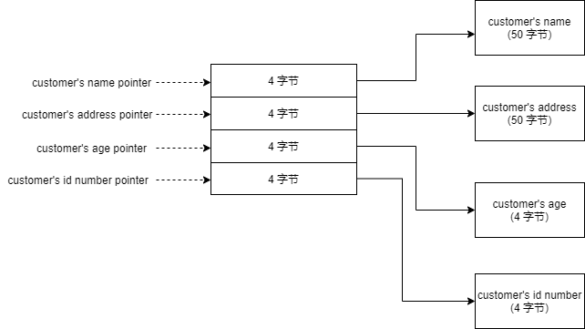

# Table of Contents

- [x] Chapter 1. Introduction
  - [x] Welcome to Programming（24.05.2021）
  - [x] Your Tools（24.05.2021）
- [ ] Chapter 2. Computer Architecture
  - [x] Structure of Computer Memory
  - [x] The CPU
  - [x] Some Terms
  - [x] Interpreting Memory
  - [x] Data Accessing Methods
  - [ ] Review
    - [ ] Know the Concepts
    - [ ] Use the Concepts
    - [ ] Going Further

# Chapter 1. Introduction

## Welcome to Programming

本书讲授 Linux 环境下 x86 汇编语言。目标：

- Understand how a program works and interacts with other programs
- Read other people's programs and learn how they work
- Learn new programming language quickly
- Learn advanced concepts in computer science quickly
- Write Code like a poem

保持忍耐力！

### Your Tools

学习时使用的环境：

- GNU/Linux (CentOS)
- GCC Set

# Chapter 2. Computer Architecture

### Structure of Computer Memory

内存由若干个内存单元组成，每个内存单位的空间大小是 1 字节。每个内存单元都有一个编号，也即地址。如下图所示：



指令和数据都存储在内存单元。

### The CPU

CPU 的组成：

- program counter(程序计数器)
- Instruction Decoder(指令翻译器)
- Data bus(数据总线)
- 通用寄存器
- 算术和逻辑单元（运算器）

fetch-execute cycle:

- CPU 从 PC 中读取下一条指令的地址
- CPU 从内存读取指令
- CPU 将指令送入指令翻译器翻译指令，得到真正的指令，数据，内存单元的地址
- 利用 data bus 从内存读取运算需要的数据
- 把数据和指令送入运算器
- 执行被执行
- 把结果经过 data bus 送入内存

### Some Terms

无

### Interpreting Memory

在内存存储客户信息的例子。有两种内存布局：

第一种：



可以根据 start of record 加每个字段的长度获取其他字段的起始地址，从而读取其他字段的值。

缺点：字段的长度必须是固定的，如果不固定，就没法定位下一个字段的起始地址。

第二种：




优点：字段的长度可以变化，不用固定死。根据指针，就可以方便的找到每个字段。

### Data Accessing Methods

CPU 读取数据的方式，即寻址模式。

#### immediate mode(直接模式)

数据就在指令中，如：

```assembly
mov ax,5
```

处理器读取数值 5 就是使用 immediate mode 。

#### register address mode(寄存器地址模式)

指令中包含寄存器，读取寄存器中的值。如：

```assembly
mov ax,bx
```

#### direct address mode(直接寻址模式)

指令中包含内存地址，读取内存地址中的内容。如：

```assembly
例子暂缺
```

#### indexed address mode(索引寻址模式)

指令中包含内存地址加偏移量，偏移量存在 index register 中。

x86 CPU 甚至可以用偏移量乘以一个基数，比如 4 。

#### indirect address mode(间接寻址模式)

指令中包含一个寄存器，寄存器中存放的是内存地址，CPU 到这个地址中读取数据

base pointer address mode(基址寻址模式)

类似间接寻址，多了一个偏移量 offset ，寻址时，把寄存器中的值加上偏移量得到地址。

上面第二种布局，如果使用间接寻址，寄存器里存 start of record ，offset = 8 ，start of record + 8 就得到 customer's age 指针的地址。

### Review

# 参考

Jonathan Bartlett, *Programming from the Ground Up*

