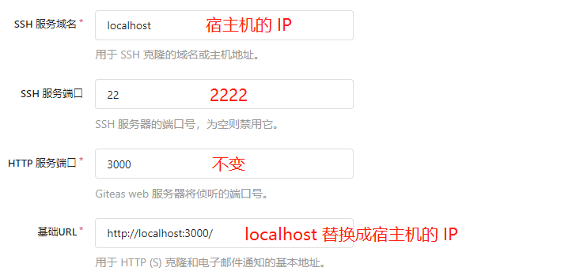
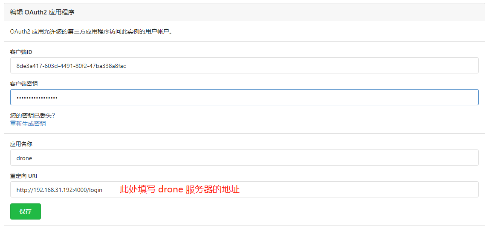
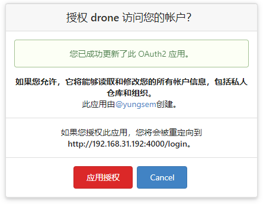
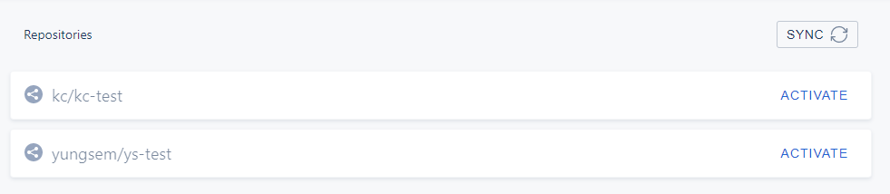

# Git

## 生成 SSH Key

执行下面的命令，创建 SSH Key：

```
ssh-keygen -t rsa -C "yungsem@126.com"
```

命令成功执行之后，会在 `/home/ys/` 目录下生成 `.ssh/` 目录，该目录下有两个文件：`id_rsa` 和 `id_rsa.pub` 。这两个文件就是 SSH Key 的密钥对，`id_rsa` 是私钥，`id_rsa.pub` 是公钥。

## 常用命令

### 配置相关

- 设置提交代码时的用户信息

```
git config --global user.name 'your_name'
git config --global user.email 'your_email'
```

### 分支相关

- 创建新分支同时切换到该新分支

```
git checkout -b new_branch_name
```

- 删除本地分支

```
git branch -D branch_name
```

- 删除远程分支

```
git push --delete origin branch_name
```

- 更改本地分支名称

```
git branch -m old_branch_name new_branch_name
```

- 更改远程分支名称，使用如下步骤：
  - 重命名本地分支
  - 删除旧的远程分支
  - 把新命名的本地分支推送到远程


- 删除本地缓存（解决`.ignore`文件无效问题）

```
git rm -r --cached .
git add .
git commit -m 'clear local cache'
```

- 清理远程仓库已删除，但是本地仓库还在追踪的分支

```
git remote prune origin
```

### 仓库相关

- 上传项目

```
git remote add origin git@git.coding.net:yungsem/webpack-demo.gitgit push -u origin master
```

## Git Commit Message 规范

### Commit Message 格式

```
<type>(<scope>): <subject><BLANK LINE><body><BLANK LINE><footer>
```

第一行称为 `header` ，`header` 是必须的，`body` 和 `footer` 是可选的。

`header` 有固定的格式，其中 `type` 和 `subject` 是必须的，`scope` 是可选的。

`commit message` 的每一行不要超过100个字符。目的是为了在 `github` 上能很方便地阅读。

如果本次提交关闭了一个 `issue` ，那么 `footer` 后面需要附带这个 `issue` 的链接。

几个例子：

```
docs(changelog): update change log to beta.5
```

```
fix(release): need to depend on latest rxjs and zone.jsThe version in our package.json gets copied to the one we publish, and users need the latest of these.
```

```
build: switch from npm to yarn (#19328)
```

### Type

`type` 必须是下列关键词之一：

- build: Changes that affect the build system or external dependencies (example scopes: gulp, broccoli, npm)
- ci: Changes to our CI configuration files and scripts (example scopes: Travis, Circle, BrowserStack, SauceLabs)
- docs: Documentation only changes
- feat: A new feature
- fix: A bug fix
- perf: A code change that improves performance
- refactor: A code change that neither fixes a bug nor adds a feature
- style: Changes that do not affect the meaning of the code (white-space, formatting, missing semi-colons, etc)
- test: Adding missing tests or correcting existing tests

### Scope

`scope` 指的是本次修改影响到的模块。

### Subject

`subject` 是对本次修改的简明描述，必须遵循以下规则：

- 使用一般现在时，动词开头
- 首字母不要大写
- 结尾没有 `.`

### body

`body` 是对本次修改的详细描述，必须遵循以下规则：

- 使用一般现在时
- 说明本次修改的原因
- 说明被修改的部分在修改前后的行为对比

### footer

`footer` 里主要两方面的内容：

- breaking change
- 本次关闭的 issue 链接

`Breaking Change` 的格式为：

```
BREAKING CHANGE: <infomation about this breaking change>
```

### Revert

如果本次 `commit` 是将代码回退到之前的版本，`header` 里的 `type` 必须是 `revert` ，具体格式如下：

```
revert: <the `header` of the reverted commit>This reverts commit <hash>.
```

## git tag

### 简述

tag 类似于 branch ，但是和 branch 不同，tag 不可以更新和 merge 。tag 就是一个快照。

### 创建 tag

创建一个 tag ：

```
git tag <tag_name>
```

创建一个带 commit message 的 tag ：

```
git tag <tag_name> -m <commit message>
```

### 查看 tag

查看 tag ：

```
git tag
```

查看指定 tag 的详细信息

```
git show <tag_name>
```

### 删除标签

```
git tag -d <tag_name>
```

### 推送 tag 到远程

```
git push origin <tag_name>
```

或者通过 --tags 参数来推送所有本地的 tag

```
git push origin --tags
```

### 删除远程 tag

当本地 tag 已经 push 到远程代码仓库后，再要删除这个 tag ，就必须删除本地 tag ：

```
git tag -d <tag_name>
```

删除本地 tag 后，再重新 push 到远程的代码仓库：

```
git push origin :refs/tags/<Tag 名字>
```

### 参考

[Git的Tag使用](https://www.jianshu.com/p/a07777d0b018)

# Gitea

## 安装

### 配置 SSH 转发

在宿主机上创建名为 git 的用户：

```sh
useradd git
```

添加成功之后，查看 /etc/passwd 文件，查看 git 用户的 UID 和 GID ：

```sh
cat /usr/passwd

git:x:1004:1004::/home/git:/bin/bash
```

可以看到 UID=1004 ，GID=1004 ，这个两个 ID 要配置到 docker-compose.yml 文件中。

接下来，在宿主机上为 git 用户创建 SSH 密钥对：

```sh
sudo -u git ssh-keygen -t rsa -b 4096 -C "Gitea Host Key"
```

然后，创建一个名为 /app/gitea/gitea 的文件，添加可执行权限。并在该文件中添加如下内容：

```sh
mkdir -p /app/gitea
touch /app/gitea/gitea
chmod +x /app/gitea/gitea
```

该文件用于将发往宿主机的 SSH 请求转发给容器。

```bash
ssh -p 2222 -o StrictHostKeyChecking=no git@127.0.0.1 "SSH_ORIGINAL_COMMAND=\"$SSH_ORIGINAL_COMMAND\" $0 $@"
```

创建 /home/git/.ssh/authorized_keys ，如果已经存在，则不用创建：

```sh
cd /home/git/.ssh/
touch authorized_keys 
```

将上面创建的 git 用户的公钥存入 authorized_keys 文件中：

```sh
echo "$(cat /home/git/.ssh/id_rsa.pub)" >> /home/git/.ssh/authorized_keys
```

### docker-compose

docker-compose.yml 文件位于 [这里](https://github.com/yungsem/docker-compose-file/blob/main/gitea/docker-compose.yml) 。

### 启动

```sh
docker-compose up -d
```

首次启动需要修改的配置：



# Drone

## 安装(Gitea)

### 创建 OAuth2 应用

在 gitea 中创建 OAuth2 应用：



生成的 Client ID 和 Client Secret 在 drone 的 docker-compose.yml 文件中使用。

### 创建共享 secret

用 openssl 创建一个共享的 secret ，供 drone server 和 drone runner 使用：

```sh
openssl rand -hex 16

0dd984415ee07bbbe718e3fe522887b8
```

生成的 secret 在 drone 和 drone runner 的 docker-compose.yml 文件中使用。

### 运行 drone 服务

使用 docker-compose 运行 drone 服务端程序，docker-compose.yml 文件见 [这里](https://github.com/yungsem/docker-compose-file/blob/main/drone/docker-compose.yml) 。

运行成功之后，在浏览器打开 http://192.168.31.192:4000 ，会自动跳到 gitea 授权页面要求授权，如下所示：



点击 `应用授权` ，进入 drone 管理页面，会自动把 gitea 的仓库同步过来，如下所示：



### 运行 drone docker runner

使用 docker-compose 运行 drone-docker-runner 程序，docker-compose.yml 文件见 [这里](https://github.com/yungsem/docker-compose-file/blob/main/drone-docker-runner/docker-compose.yml) 。

## 示例

示例项目见 [这里](https://github.com/yungsem/spring-boot-drone) 。

重点关注 [.drone.yml](https://github.com/yungsem/spring-boot-drone/blob/main/.drone.yml) 文件 和 [run.sh](https://github.com/yungsem/spring-boot-drone/blob/main/run.sh) 文件。

## 自己构建企业版 Drone

Dockerfile 见 [这里]() 。

## 参考

https://docs.drone.io/server/provider/gitea/

https://docs.drone.io/runner/docker/installation/linux/

# Nginx

