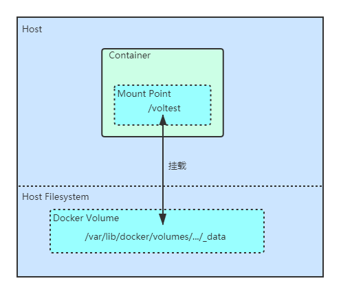
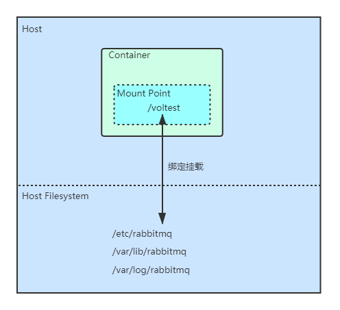

# Docker

## 安装 Docker

### 建立仓库

首次通过仓库安装 Docker 需要先建立 Docker 仓库。仓库一旦建立，就可以通过仓库直接安装 Docker 了，官方推荐使用该方式安装 Docker 。

1. 安装依赖包
- yum-utils 提供 yum-config-manager 工具集
- device-mapper-persistent-data 包和 lvm2 是 devicemapper 存储驱动所需要的依赖

```
sudo yum install -y yum-utils \
  device-mapper-persistent-data \
  lvm2
```

2. 建立稳定版仓库
依赖包安装成功之后，我们就可以建立仓库了，执行下面的命令：
```
sudo yum-config-manager \
    --add-repo \
    https://download.docker.com/linux/centos/docker-ce.repo
```

3. （可选）启用 nightly 仓库和 test 仓库
```
sudo yum-config-manager --enable docker-ce-nightly

sudo yum-config-manager --enable docker-ce-test
```

这两个仓库不是必装的，如果想要停用这两个仓库，执行下面的命令：
```
sudo yum-config-manager --disable docker-ce-nightly

sudo yum-config-manager --disable docker-ce-test
```

### 安装
1. 安装
执行下面的命令安装最新版的 Docker
```
sudo yum -y install docker-ce docker-ce-cli containerd.io
```

2. 运行 Docker
安装成功之后，就可以开时运行 Docker 了：
```
sudo systemctl start docker
```

3. 验证 Docker 是否安装成功
```
sudo docker run hello-world
```
该命令从镜像仓库拉去一个名为 hello-world 的测试镜像，并创建一个容器运行该镜像，如果运行成功，会看到如下输出：
```
Hello from Docker!
This message shows that your installation appears to be working correctly.

To generate this message, Docker took the following steps:
 1. The Docker client contacted the Docker daemon.
 2. The Docker daemon pulled the "hello-world" image from the Docker Hub.
    (amd64)
 3. The Docker daemon created a new container from that image which runs the
    executable that produces the output you are currently reading.
 4. The Docker daemon streamed that output to the Docker client, which sent it
    to your terminal.

To try something more ambitious, you can run an Ubuntu container with:
 $ docker run -it ubuntu bash

Share images, automate workflows, and more with a free Docker ID:
 https://hub.docker.com/

For more examples and ideas, visit:
 https://docs.docker.com/get-started/
```

### 启停
我们的 Docker 是使用 yum 安装的， yum 安装的软件都会受 systemctl 管理，所以可以使用标准的 systemctl 命令管理 Docker 的启停。

```
# 启动
systemctl start docker

# 停用
systemctl stop docker

# 重启
systemctl restart docker

# 设置为开机自启
systemctl enable docker
```

### 参考
[Get Docker Engine - Community for CentOS](https://docs.docker.com/install/linux/docker-ce/centos/)
## Dockerfile 命令

### FROM
**格式**

```
FROM <image>
FROM <image>:<tag>
```

**用途**

FROM 用于指定一个基础镜像。后面的命令会依赖这个基础镜像。Dockerfile 必须以 FROM 命令开始。

**示例**

```
FROM scratch
```
scratch 是一个最基础的镜像，绝大多数官方的 Docker 镜像都是以 scratch 为基础镜像。


### LABEL
**格式**

```
LABEL <key>=<value> <key>=<value> <key>=<value> ...
```

**用途**

LABEL 用于向镜像添加元信息（metadata）。我们在制作 Dockerfile 文件时，最佳实践是添加必要的元信息。

**示例**

```
LABEL maintainer="yungsem"
LABEL email="yungsem@126.com"
LABEL version="1.0"
LABEL description="a test image"
```

### RUN
**格式**

```
RUN <command>
```

**用途**

RUN 用于在 `docker build` 时执行命令，注意不是在 `docker run` 时执行。

每一条 RUN 命令都会提交一个新的 layer ，所以最佳实践是将多条命令并成一条，放在一个 RUN 中执行。

**示例**

```
# Install Nginx.
RUN \
  add-apt-repository -y ppa:nginx/stable && \
  apt-get update && \
  apt-get install -y nginx && \
  rm -rf /var/lib/apt/lists/* && \
  echo "\ndaemon off;" >> /etc/nginx/nginx.conf && \
  chown -R www-data:www-data /var/lib/nginx
```

### WORKDIR
**格式**

```
WORKDIR /path/to/workdir
```

**用途**

WORKDIR 指定下面几个命令的当前工作目录，有点类似于 cd 命令：
- RUN
- CMD
- ENTRYPOINT
- COPY
- ADD

这些命令必须放在 WORKDIR 命令后面，才能使用 WORKDIR 指定的目录作为当前工作目录。

WORKDIR 命令可以多次使用，如果命令后面跟的是相对路径，则是相对上一个 WORKDIR 命令指定的目录。如：
```
WORKDIR /a
WORKDIR b
WORKDIR c
RUN pwd
```
输出：/a/b/c

最佳实践是在 WORKDIR 后面指定绝对路径，不要使用相对路径。

**示例**

```
# Define working directory.
WORKDIR /etc/nginx
```

### COPY
**格式**

```
COPY [--chown=<user>:<group>] <src>... <dest>
```

**用途**

如果 src 是文件，则将宿主主机 src 文件复制到容器的 dest 目录下。

如果 src 是目录，则将宿主主机 src 目录下所有的文件都复制到容器的 dest 目录下

可以指定多个 src ，用空格隔开。

src 的路径是相对路径，相对于 Dockerfile 所在目录。

dest 的路径是绝对路径。如果路径不存在则会自动级联创建。如果非要使用相对路径，则是相对于 `WORKDIR` 的。

**示例**

将宿主主机当前目录下的 app.jar 文件复制到容器的 /app 目录下：
```
FROM centos
LABEL maintainer=yungsem \
      email=yungsem@126.com
COPY app.jar /app/
CMD cat app.jar
```

将宿主主机当前目录下的 app.jar 文件复制到容器的 /app/file 目录下：
```
FROM centos
LABEL maintainer=yungsem \
      email=yungsem@126.com	
WORKDIR /app
COPY app.jar file/ 
CMD cat /app/file/app.jar
```

将宿主主机当前目录下 temp 目录下的所有文件都复制到容器的 /app/file 目录下：
```
FROM centos
LABEL maintainer=yungsem \
      email=yungsem@126.com	
WORKDIR /app
COPY temp/ file/
```

### ENV
**格式**

设置单个变量：
```
ENV <key> <value>
```

设置多个变量：
```
ENV <key>=<value> ...
```

**用途**

ENV 定义了一个或一组环境变量。

在后面的 Dockerfile 命令中可以使用这些环境变量。

在运行容器时，也可以通过 `--env <key>=<value>` 参数来动态指定这些环境变量的值。

**示例**

Dockerfile 文件：
```
FROM centos
ENV name1=Docker1 name2=Docker2
ENTRYPOINT echo "hello, $name1" && echo "hello, $name2"
```

构建镜像：
```
docker build -t env-sample .
```

不带 `--env` 参数运行容器：
```
docker run env-sample

```
输出：
```
hello, Docker1
hello, Docker2
```

带 `--env` 参数运行容器：
```
docker run --env name1=ys1 --env name2=ys2 env-sample
```
输出：
```
hello, ys1
hello, ys2
```

### CMD
**格式**

exec 格式（推荐）：
```
CMD ["executable","param1","param2"]
```

shell 格式：
```
CMD command param1 param2
```

**用途**

CMD 指定了一条可执行的命令。这条命令在 `docker build` 时不会执行，在 `docker run` 时会执行。

要注意 RUN 和 CMD 的区别：RUN 指定的命令在 `docker build` 时会执行，并且把执行的结果提交为新的镜像；而 CMD 指定的命令是在 `docker run` 时执行。

一个 Dockerfile 里只能有一条 CMD ，如果出现多条，最后出现的那一条有效，其他的无效。

`docker run <image>` 后面跟的命令和参数会覆盖 CMD 指定的命令和参数。

**示例**

Dockerfile 文件：
```
FROM centos
CMD ["ls", "-l"]
CMD ["echo", "hello"]
```

构建镜像：
```
docker build -t cmd-sample .
```

运行容器，只执行最后一条：
```
docker run cmd-sample

hello
```

运行容器，覆盖命令和参数：
```
docker run cmd-sample echo world

world
```

### ENTRYPOINT
**格式**

exec 格式（推荐）：
```
CMD ["executable","param1","param2"]
```

shell 格式：
```
CMD command param1 param2
```

**用途**

ENTRYPOINT 指定了一条可执行的命令。在 `docker run` 时会执行这条命令。

一个 Dockerfile 里只能有一条 ENTRYPOINT ，如果出现多条，最后出现的那一条有效，其他的无效。

使用 exec 格式定义 ENTRYPOINT ，`docker run <image>` 后面跟的参数也会被传递给 ENTRYPOINT 。

**示例**

Dockerfile 文件：
```
FROM centos
ENTRYPOINT ["echo", "hello"]
ENTRYPOINT ["ls", "-a"]
```

构建镜像：
```
docker build -t entrypoint-sample .
```

运行容器，只执行最后一条：
```
docker run entrypoint-sample

.
..
.dockerenv
bin
dev
etc
home
lib
lib64
lost+found
media
mnt
opt
proc
root
run
sbin
srv
sys
tmp
usr
```

运行容器，参数传递：
```
docker run entrypoint-sapmle -l

total 0
drwxr-xr-x.   1 root root   6 Mar  6 04:58 .
drwxr-xr-x.   1 root root   6 Mar  6 04:58 ..
-rwxr-xr-x.   1 root root   0 Mar  6 04:58 .dockerenv
lrwxrwxrwx.   1 root root   7 Nov  3 15:22 bin -> usr/bin
drwxr-xr-x.   5 root root 340 Mar  6 04:58 dev
drwxr-xr-x.   1 root root  66 Mar  6 04:58 etc
drwxr-xr-x.   2 root root   6 Nov  3 15:22 home
lrwxrwxrwx.   1 root root   7 Nov  3 15:22 lib -> usr/lib
lrwxrwxrwx.   1 root root   9 Nov  3 15:22 lib64 -> usr/lib64
drwx------.   2 root root   6 Dec  4 17:37 lost+found
drwxr-xr-x.   2 root root   6 Nov  3 15:22 media
drwxr-xr-x.   2 root root   6 Nov  3 15:22 mnt
drwxr-xr-x.   2 root root   6 Nov  3 15:22 opt
dr-xr-xr-x. 144 root root   0 Mar  6 04:58 proc
dr-xr-x---.   2 root root 162 Dec  4 17:37 root
drwxr-xr-x.  11 root root 163 Dec  4 17:37 run
lrwxrwxrwx.   1 root root   8 Nov  3 15:22 sbin -> usr/sbin
drwxr-xr-x.   2 root root   6 Nov  3 15:22 srv
dr-xr-xr-x.  13 root root   0 Mar  2 14:07 sys
drwxrwxrwt.   7 root root 145 Dec  4 17:37 tmp
drwxr-xr-x.  12 root root 144 Dec  4 17:37 usr
drwxr-xr-x.  20 root root 262 Dec  4 17:37 var
```

### EXPOSE
**格式**

```
EXPOSE <port>
EXPOSE <port>/<protocol>
```

**用途**

EXPOSE 指定了一个端口号，运行改镜像得到的容器会监听这个端口。在指定端口的同时也可以指定协议，如：TCP 或者 UDP ，如果不指定，则默认使用 TCP 。

这个端口是多个容易互联（link）时用的端口，并不是暴露给宿主主机的端口，要想指定暴露个宿主主机的端口，使用 `docker run <image> -p` 。

**示例**

官方 nginx 的 Dockerfile ：
```
FROM dockerfile/ubuntu

RUN \
  add-apt-repository -y ppa:nginx/stable && \
  apt-get update && \
  apt-get install -y nginx && \
  rm -rf /var/lib/apt/lists/* && \
  echo "\ndaemon off;" >> /etc/nginx/nginx.conf && \
  chown -R www-data:www-data /var/lib/nginx

VOLUME ["/etc/nginx/sites-enabled", "/etc/nginx/certs", "/etc/nginx/conf.d", "/var/log/nginx", "/var/www/html"]

WORKDIR /etc/nginx

CMD ["nginx"]

EXPOSE 80
EXPOSE 443
```
## Docker 镜像

### 如何获取镜像
获取镜像有两种方式：
- 基于 Dockerfile 文件构建镜像
- 从公有镜像仓库或私有镜像仓库拉取镜像

### 构建镜像
命令：
```
docker build -t image_name:image_tag path_to_Dockerfile
```

### 拉取镜像
命令：
```
docker pull docker_registry_ip:port/<username>/<image_name>:<tag>
```

如果从 Docker Hub 上拉取镜像，可以使用：
```
docker pull <username>/<image_name>:<tag>

docker pull <image_name>:<tag>
```
- docker_registry_ip:port 是默认的：docker.io
- username 不指定就使用默认的：library

如：
```
docker pull redis
```
等同于
```
docker pull docker.io/library/redis:latest
```

### 推送镜像
命令：
```
docker push docker_registry_ip:port/<username>/<image_name>:<tag>
```


如果往 Docker Hub 上推送镜像，可以使用：
```
docker push <username>/<image_name>:<tag>
```
- docker_registry_ip:port 是默认的：docker.io

如：

```
docker push yungsem/admin-srv:0.0.1
```
等同于：
```
docker push docker.io/yungsem/admin-srv:0.0.1
```

### 镜像常用命令
列出最近使用的镜像：
```
docker images
```

列出所有镜像：
```
docker images -a
```

列出所有镜像，只显示 ID ：
```
docker images -aq
```

删除镜像：
```
docker rmi image_id
```

强制删除镜像：
```
docker rmi -f image_id
```

删除所有镜像：
```
docker rmi $(docker images -aq)
```

查看容器详细信息：
```
docker inspect image_id
```
## 搭建 Docker 私有镜像仓库

https://github.com/goharbor/harbor
## Docker 容器

### 运行容器
```
docker run [OPTIONS] IMAGE [COMMAND] [ARG...]
```
|选项|默认值|说明|
|-|-|-|
|-d||后台运行容器|
|-h||指定容器的 hostname|
|--mount||指定宿主主机的目录，挂载到容器上|
|--name||容器名称|
|-p||向宿主主机映射端口|
|--restart|no|重启策略|
|-v||挂载卷|


### 容器常用命令
列出正在运行的容器：
```
docker ps
```

列出所有容器：
```
docker ps -a
```

列出所有容器，只显示 ID ：
```
docker ps -aq
```

删除容器：
```
docker rm container_id
```

强制删除容器：
```
docker rm -f container_id
```

删除所有容器：
```
docker rm $(docker ps -aq)
```

查看容器详细信息：
```
docker inspect container_id
```
## Docker 数据卷

### 概述
一个容器在运行时不可避免的要产生数据，默认情况下，这些数据会随着容器的删除而删除。但是有些数据是不能随容器的删除而删除的。比如一个 MySQL 容器，当我们因为某种迫不得已的原因要删除这个容器重新启一个时，我们肯定不希望我们建的数据库和表数据随之删除。

这就需要对容器产生的数据进行持久化。

Docker 提供了两种方式将容器内的数据持久化到宿主机里。
- 数据卷（Volumes）
- 绑定挂载 （Bind mounts）

今天我们来讲数据卷。

### 什么是数据卷
本质上，数据卷其实就是宿主机里的一个目录。如下图所示：




数据卷分为 `匿名数据卷` 和 `具名数据卷` 。

匿名数据卷由 Docker 自动命名，是一串很长的唯一的 Hash 值。如：
```
/var/lib/docker/volumes/91178371ead69bbae5b1d543e7bff08e7170ae39c3e57b5256e9b771630d15d9/_data
```

具名数据卷是我们自己命名的数据卷。下面是一个名为 volt 的具名数据卷：
```
/var/lib/docker/volumes/volt/_data
```

### 匿名数据卷
创建一个匿名数据卷有两种方式，第一种是通过 Dockerfile 文件中的 VOLUME 指令。

下面的 Dockerfile 文件中，使用 VOLUME 指令在容器内定义了一个挂载点 `/volt`：
```
FROM centos
VOLUME ["/volt"]
```

当我们使用 `docker run` 命令创建相关容器时，Docker 会自动为我们在宿主机里创建一个匿名数据卷，并挂载到容器里的 `/volt` 目录。

第二种创建匿名数据卷的方式是通过 `docker run` 命令的 `-v` 参数：
```
docker run --name volt -v /volt yungsem/volt
```
上面的命令利用镜像 `yungsem/volt` 创建了一个名为 `volt` 的容器。同时，通过 `-v` 参数指定了容器内的挂载点 `/volt` 。此时，Docker 也会自动在宿主机里创建一个匿名数据卷，挂载到容器里的 `/volt` 目录。


### 具名数据卷
我们可以手动创建一个数据卷，命令如下：
```
docker volume create myvol
```
此时创建的数据卷就是具名数据卷，其名称为 `myvol` 。

有了数据卷，我们要将其挂载到容器里。我们仍然可以通过 `docker run` 命令 `-v` 参数进行挂载：
```
docker run --name volt -v myvol:/volt yungsem/volt
```
这样一来，就将我们创建的具名数据卷 `myvol` 挂载到容器里的 `/volt` 目录了。


其实，在上面的例子中，使用 `docker volume create` 命令手动创建具名数据卷这一步可以省略。我们可以直接在 `docker run` 命令的 `-v` 参数指定还没有创建的具名数据卷，Docker 会为我们自动创建。如：
```
docker run --name volt -v myvol2:/volt yungsem/volt
```
Docker 会自动创建一个名为 `myvol2` 的数据卷。

### 数据卷相关命令
创建一个数据卷：
```
docker volume create volume_name
```

查看所有数据卷：
```
docker volume ls
```

查看指定数据卷的具体信息：
```
docker inspect volume_name
```

删除数据卷：
```
docker volume rm volume_name
```

清理无主的数据卷：
```
docker volume prune
```

### 参考
[Manage data in Docker](https://docs.docker.com/storage/)

[Use volumes](https://docs.docker.com/storage/volumes/)
## Docker 绑定挂载

### 什么是绑定挂载
Docker 提供的另一种数据持久化方式是绑定挂载 （Bind mounts）。

绑定挂载就是将容器的目录或文件和宿主机的目录或文件进行绑定。这样，在容器和宿主机的任意一方的目录或文件做出的变更，另一方都能同步到。



它和数据卷在宿主机里都是目录，区别就是数据卷由 Docker 管理，而绑定的宿主机目录就是普通的目录，任何人都可以更改。

### 绑定挂载
绑定挂载也是通过 `docker run` 命令的 `-v` 参数实现的。

如：
```
docker run \
-d \
--hostname rabbit \
--restart=always \
--name rabbitmq \
-v /etc/rabbitmq:/etc/rabbitmq \
-p 15672:15672 -p 5672:5672 95bc78c8d15d 
```
上面的命令将宿主机的 `/etc/rabbitmq` 目录同容器的 `/etc/rabbitmq` 目录进行绑定。

注意：使用 `-v` 参数镜像绑定挂载，宿主机的目录或文件必须是绝对路径，也即以 `/` 开始。

### 参考
[Manage data in Docker](https://docs.docker.com/storage/)

[Use bind mounts](https://docs.docker.com/storage/bind-mounts/)

# Docker Compose
## 安装 Docker Compose

### 安装
1. 下载最新稳定版的 docker-compose 可执行文件：
```
sudo curl -L "https://github.com/docker/compose/releases/download/1.24.1/docker-compose-$(uname -s)-$(uname -m)" -o /usr/local/bin/docker-compose
```
下载后，docker-compose 可执行文件的存放目录为：/usr/local/bin/docker-compose 。

如果提示
```
-bash: curl: command not found
```

则需要先安装 curl ，执行下面的命令安装 curl ：
```
yum install curl
```

2. 添加执行权限
刚下在下来的 docker-compose 文件是没有执行权限的，我们需要为其添加可执行权限：
```
sudo chmod +x /usr/local/bin/docker-compose
```

3. 建立软链接
为了方便在任意目录执行 `docker-compose` 命令，我们可以创建一个软链接：
```
sudo ln -s /usr/local/bin/docker-compose /usr/bin/docker-compose
```

4. 验证是否安装成功
```
docker-compose --version
```

正常输出：
```
docker-compose version 1.24.1, build 1110ad01
```

### 参考
[Install Docker Compose](https://docs.docker.com/compose/install/)
## Compose file 文件

### docker-compose.yml 的结构
一个 docker-compose.yml 主要由四部分组成：
```yml
versin: "3"

services:

volumes:

networks:
```

### version
格式：
```yml
version: "3.8"
```
用途：指定 compose-file 语法格式的版本。

### services
services 下面可以定义多个 service ，一个 service 就对应一个容器。

如果使用 docker swarm ，一个 service 也即 docker swarm 的一个 service 。

一个典型的 services 内容结构如下：
```yml
services:
  service1:
    image: image_address
    container_name: mycontainer
    restart: unless-stopped
    networks:
      - mynet
    volumes:
      - myvol:path_to_mount_in_container
    ports:
      - host_port:container_port
    expose:
      - container_port
    environment:
      - key: value

  service2:
    build: path_to_Dockerfile
    ports: 
      - container_port
```
|配置项|用途|
|-|-|
|restart|重启策略，常用的可选值有：always 和 unless-stopped 。<br>- always：如果容器停止，则一直尝试重启<br>- unless-stopped：和 always 类似，如果容器本来就是停止的（被手动停止或意外停止），则不尝试重启，即使 Docker 服务重启了该容器也不重启|


### networks
格式：
```yml
networks:
  network_name:
    driver: overlay
    attachable: true
```
用途：创建网络。
- network_name：指定新创建的 network 的名称
- driver：指定 network 使用的模式（驱动）。
  - bridge
  - overlay
- attachable：只在 driver = overlay 时有用。如果配置为 true ，则允许独立运行的容器（不属于 swarm 下的 service ）连接到该 network
- external：如果设置为 true ，则不创建新的 network 。加入名称为 network_name 的已有网络

### volumes
格式：
```yml
volumes:
  volumn_name:
```

用途：在宿主机创建一个名为 volumn_name 的数据卷，各个 service 可以使用该数据卷。

示例：
```yml
services:
  redis:
    volumes:
      #将数据卷 vol_redis 挂载到容器里的 /var/lib/redis 目录
      - vol_redis:/var/lib/redis

volumes:
  #创建一个名称为 vol_redis 的具名数据卷
  vol_redis:
```

### 完整的示例
```yml
version: '3.5'

services:
  base-auth-srv:
    image: yungsem.cn/yungsem/base-auth-srv:0.0.1
    container_name: base-auth-srv
    restart: unless-stopped
    environment:
      - JAVA_OPTS=-Xmx512m -Xms512m
      - SPRING_PROFILES_ACTIVE=prod
      - SERVER_PORT=8080
    volumes:
      - /etc/localtime:/etc/localtime:ro # 保持容器时区于宿主机一致
      - /home/jenkins/volumns/logs/:/app/logs/
      - /home/jenkins/volumns/files/:/app/files/
    networks:
      - yungsem-net
    ports:
      - 8081:8080
networks:
  yungsem-net:
    driver: bridge
```

### 参考
[Compose file version 3 reference](https://docs.docker.com/compose/compose-file/)
## docker-compose 命令

### docker-compose up
格式：
```
docker-compose up [options] [--scale SERVICE=NUM...] [SERVICE...]
```
options:
- -d 后台运行

### docker-compose down
格式：
```
docker-compose down  [options]
```

### docker-compose ps
格式：
```
docker-compose ps [options] [SERVICE...]
```
options:
- -q
- -a

### docker-compose logs
格式：
```
docker-compose logs [options] [SERVICE...]
```
options:
- -f Follow log output.
- -t Show timestamps.
- --tail="all" Number of lines to show from the end of the logs for each container.

# Potainer

# Docker Swarm

# K8S
