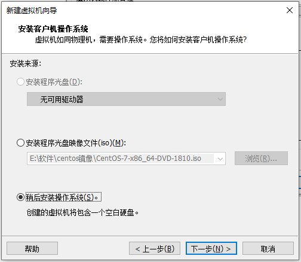
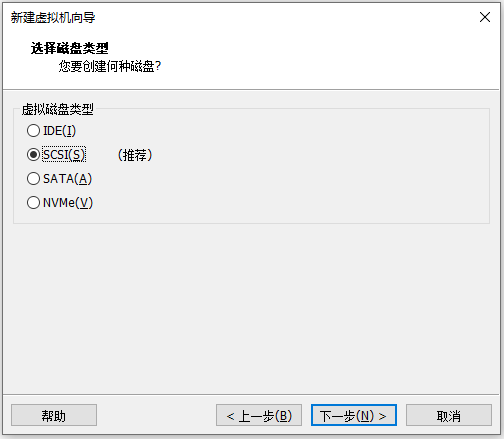

# 基本概念

## 集群组件概述

### 控制面板组件

控制面板组件一般运行在主节点上。

- kube-apiserver

  Kubernetes API 的实现，将这些 Kubernetes API 暴露出来，供 node 节点和控制面板通信用。

- etcd

  一个 key-value 数据库，用于存储 k8s 集群的数据。使用时要注意启动备份计划。

- kube-scheduler

  监听新创建的 Pod ，并为该 Pod 分配合适的 node 节点。注意了解调度策略。

- kube-controller-manager

  负责管理和运行 controller 。逻辑上看，每一个 controller 都是一个独立的进程。但是实际上，所有的 controller 被打包成一个二进制文件运行，对应一个进程。有如下类型的 controller :

  - Node controller: 负责响应 node 节点下线。
  -  Job controller: 监听一次性的任务，创建 Pod 执行该任务。
  - Endpoints controller:
  - Service Account & Token controllers: 为新 namespace 创建默认账号和 token 。

- cloud-controller-manager

   感觉用不到，先略了。

### 节点组件

- kubelet

  kubelet 运行在从节点上。负责管理 Pod ，将 k8s 创建的容器放入 Pod 中运行。

- kube-proxy

  kube-proxy 运行在从节点上。是一个网络代理。

- Container runtime

  容器运行时，最典型的容器运行时就是 Docker 。

### 插件

- DNS

  DNS 服务器。

- Dashboard

  管理端。

- Container Resource Monitoring

- eCluster-level Logging

# 安装k8s集群

## 准备服务器

### 创建虚拟机








### 安装CentOS


### 配置网络


打开网络配置文件：
```
vi /etc/sysconfig/network-scripts/ifcfg-ens33
```

修改后的配置：
```
TYPE=Ethernet
PROXY_METHOD=none
BROWSER_ONLY=no
BOOTPROTO=static
DEFROUTE=yes
IPV4_FAILURE_FATAL=no
IPV6INIT=yes
IPV6_AUTOCONF=yes
IPV6_DEFROUTE=yes
IPV6_FAILURE_FATAL=no
IPV6_ADDR_GEN_MODE=stable-privacy
NAME=ens33
UUID=62789788-8b39-4dbb-93b1-55639e3e2432
DEVICE=ens33
ONBOOT=yes
IPADDR=192.168.31.180
NETMASK=255.255.255.0
GATEWAY=192.168.31.1
DNS1=192.168.31.1
DNS2=114.114.114.114
```

重启网络服务：
```
systemctl restart network.service
```

验证：
```sh
ping www.baidu.com
```

### 服务器概览

安装 k8s 集群的 3 台主机的信息如下：

| hostname | ip             |
| -------- | -------------- |
| k8s-m1   | 192.168.31.160 |
| k8s-n1   | 192.168.31.161 |
| k8s-n2   | 192.168.31.162 |

## 设置CentOS

### 设置 hostname

```sh
hostnamectl set-hostname k8s-m1
```

### 修改 host 文件 

在 host 文件中都添加如下内容：

```
cat <<EOF >>/etc/hosts
192.168.31.160 k8s-m1
192.168.31.161 k8s-n1
192.168.31.162 k8s-n2
EOF
```

### 关闭 swap 分区

删除 swap 区所有内容：

```sh
swapoff -a
```

打开 /etc/fstab 文件，注释 swap 那一行：

```sh
vim /etc/fstab
```

```sh
/dev/mapper/centos-root /                       xfs     defaults        0 0
UUID=eca27965-200e-4982-846e-8e41fe290e7b /boot                   xfs     defaults        0 0
/dev/mapper/centos-home /home                   xfs     defaults        0 0
#/dev/mapper/centos-swap swap                    swap    defaults        0 0
```

重启系统：

```sh
reboot
```

查看是否成功关闭：

```sh
free -h
```

```sh
              total        used        free      shared  buff/cache   available
Mem:           1.8G        142M        1.5G        9.5M        173M        1.5G
Swap:            0B          0B          0B
```

Swap 那一行都是 0 ，表示已经成功关闭。

### 关闭 SELinux

查看 selinux 当前状态：

```sh
sestatus

SELinux status:                 enabled
SELinuxfs mount:                /sys/fs/selinux
SELinux root directory:         /etc/selinux
Loaded policy name:             targeted
Current mode:                   enforcing
Mode from config file:          disabled
Policy MLS status:              enabled
Policy deny_unknown status:     allowed
Max kernel policy version:      31
```

打开 /etc/selinux/config 文件：

```sh
vim /etc/selinux/config
```

将

```sh
SELINUX=enforcing
```

修改成：

```sh
SELINUX=disabled
```

重启系统：

```sh
reboot
```

再次查看 selinux 当前状态：

```sh
sestatus

SELinux status:                 disabled
```

### 切换防火墙

关闭 firewalld ：

```sh
systemctl stop firewalld
systemctl disable firewalld
```

安装 iptables-services ：

```sh
yum -y install iptables-services
```

启用 iptables ：

```sh
systemctl start iptables
systemctl enable iptables
```

清除防火墙规则：

```sh
iptables -F
service iptables save
```

### 设置系统日志

创建保存日志的目录：

```sh
mkdir /var/log/journal
```

创建保存配置文件的目录：

```sh
mkdir /etc/systemd/journald.conf.d
```

创建配置文件：

```sh
cat > /etc/systemd/journald.conf.d/99-prophet.conf <<EOF
[Journal]
# 持久化保存到磁盘
Storage=persistent
# 压缩历史日志
Compress=yes
SyncIntervalSec=5m
RateLimitInterval=30s
RateLimitBurst=1000
# 最大占用空间 10G
SystemMaxUse=10G
# 单日志文件最大 200M
SystemMaxFileSize=200M
# 日志保存时间 2 周
MaxRetentionSec=2week
# 不将日志转发到 syslog
ForwardToSyslog=no
EOF
```

重启 systemd-journald 服务：

```sh
systemctl restart systemd-journald
```

### 关闭邮件服务

```sh
systemctl stop postfix
systemctl disable postfix
```

### 升级内核

查看当前内核版本：

```sh
uname -msr
```

启用 ELRepo  仓库：

```sh
rpm --import https://www.elrepo.org/RPM-GPG-KEY-elrepo.org
```

安装 ELRepo  仓库：

```sh
rpm -Uvh https://www.elrepo.org/elrepo-release-7.0-3.el7.elrepo.noarch.rpm
```

查看可用的内核版本：

```sh
yum list available --disablerepo='*' --enablerepo=elrepo-kernel
```

安装新版本内核：

```sh
yum --enablerepo=elrepo-kernel install -y kernel-lt
```

重启：

```sh
reboot
```

设置默认内核：

```sh
vim /etc/default/grub
```

将文件中

```sh
GRUB_DEFAULT=X
```

改成：

```sh
GRUB_DEFAULT=0
```

重新创建启动配置：

```sh
grub2-mkconfig -o /boot/grub2/grub.cfg
```

重启：

```sh
reboot
```

### 开启相关网络模块

开启 br_netfilter 模块：

```sh
modprobe br_netfilter
modprobe -- ip_vs
modprobe -- ip_vs_rr
modprobe -- ip_vs_wrr
modprobe -- ip_vs_sh
modprobe -- nf_conntrack
```

查看开启情况：

```sh
lsmod | grep br_netfilter
lsmod | grep ip_vs
```

调整内核参数：

```sh
cat <<EOF | sudo tee /etc/modules-load.d/k8s.conf
br_netfilter
EOF

cat <<EOF | sudo tee /etc/sysctl.d/k8s.conf
net.bridge.bridge-nf-call-ip6tables = 1
net.bridge.bridge-nf-call-iptables = 1
EOF

sysctl --system
```


### 安装依赖包

先安装后续需要的依赖包：

```sh
yum install -y conntrack ntpdate ntp ipvsadm ipset jq iptables curl sysstat libseccomp wget vim net-tools git
```

## 安装 Docker

安装依赖包：

```sh
yum install -y yum-utils \
  device-mapper-persistent-data \
  lvm2
```

建立仓库：

```sh
yum-config-manager \
    --add-repo \
    http://mirrors.aliyun.com/docker-ce/linux/centos/docker-ce.repo
```

安装：

```sh
yum -y install docker-ce
```

安装完重启。然后启动 Docker ：

```sh
systemctl start docker
systemctl enable docker
```

配置 Docker ：

```sh
cat > /etc/docker/daemon.json <<EOF
{
    "exec-opts": ["native.cgroupdriver=systemd"],
    "log-driver": "json-file",
    "log-opts": {
    	"max-size": "100m"
    }
}
EOF

mkdir -p /etc/systemd/system/docker.service.d

systemctl daemon-reload && systemctl restart docker && systemctl enable docker
```

## 安装 kubeadm 和 kubectl 和 kubelet 

设置仓库：

```sh
cat <<EOF > /etc/yum.repos.d/kubernetes.repo
[kubernetes]
name=Kubernetes
baseurl=http://mirrors.aliyun.com/kubernetes/yum/repos/kubernetes-el7-x86_64
enabled=1
gpgcheck=0
repo_gpgcheck=0
gpgkey=http://mirrors.aliyun.com/kubernetes/yum/doc/yum-key.gpg
http://mirrors.aliyun.com/kubernetes/yum/doc/rpm-package-key.gpg
EOF
```

安装：

```sh
yum install -y kubelet kubeadm kubectl
```

启动：

```sh
systemctl enable kubelet.service
```

## 搭建集群

### 准备镜像

在能翻墙的服务器上拉取镜像包：

```sh
docker pull k8s.gcr.io/kube-controller-manager:v1.21.3
docker pull k8s.gcr.io/kube-scheduler:v1.21.3
docker pull k8s.gcr.io/kube-apiserver:v1.21.3
docker pull k8s.gcr.io/kube-proxy:v1.21.3

docker pull k8s.gcr.io/pause:3.2
docker pull k8s.gcr.io/etcd:3.4.13-0
docker pull k8s.gcr.io/coredns:1.7.0
```

将镜像打包：

```sh
docker save k8s.gcr.io/kube-controller-manager:v1.21.3 -o kube-controller-manager.tar 
docker save k8s.gcr.io/kube-scheduler:v1.21.3 -o kube-scheduler.tar
docker save k8s.gcr.io/kube-apiserver:v1.21.3 -o kube-apiserver.tar
docker save k8s.gcr.io/kube-proxy:v1.21.3 -o kube-proxy.tar

docker save k8s.gcr.io/pause:3.4.1 -o pause.tar
docker save k8s.gcr.io/etcd:3.4.13-0 -o etcd.tar
docker save k8s.gcr.io/coredns/coredns:v1.8.0 -o coredns.tar
```

使用 scp 命令将打包后的镜像包复制到 k8s 服务器：

```sh
scp root@xxxxx:/root/*.tar .
```

载入镜像包：

```sh
docker load -i kube-controller-manager.tar 
docker load -i kube-scheduler.tar
docker load -i kube-apiserver.tar
docker load -i kube-proxy.tar
docker load -i pause.tar
docker load -i etcd.tar
docker load -i coredns.tar
```

### 初始化主节点

以下只需在主节点执行。

打印默认的 k8s 配置，写入到文件 kubeadm-config.yaml 中：

```sh
kubeadm config print init-defaults > kubeadm-config.yaml
```
默认内容如下：

```yaml
apiVersion: kubeadm.k8s.io/v1beta2
bootstrapTokens:
- groups:
  - system:bootstrappers:kubeadm:default-node-token
  token: abcdef.0123456789abcdef
  ttl: 24h0m0s
  usages:
  - signing
  - authentication
kind: InitConfiguration
localAPIEndpoint:
  advertiseAddress: 1.2.3.4 #需要修改
  bindPort: 6443
nodeRegistration:
  criSocket: /var/run/dockershim.sock
  name: node #需要修改
  taints: null
---
apiServer:
  timeoutForControlPlane: 4m0s
apiVersion: kubeadm.k8s.io/v1beta2
certificatesDir: /etc/kubernetes/pki
clusterName: kubernetes
controllerManager: {}
dns:
  type: CoreDNS
etcd:
  local:
    dataDir: /var/lib/etcd
imageRepository: k8s.gcr.io
kind: ClusterConfiguration
kubernetesVersion: 1.21.0 #需要修改
networking: 
  podSubnet: "10.244.0.0/16" #增加这一行
  dnsDomain: cluster.local
  serviceSubnet: 10.96.0.0/12
scheduler: {}
--- #增加以下内容
apiVersion: kubeproxy.config.k8s.io/v1alpha1
kind: KubeProxyConfiguration
mode: ipvs
```

初始化主节点 ：

```sh
kubeadm init --config=kubeadm-config.yaml | tee kubeadm-init.log
```

如果出错，要先重置：

```sh
kubeadm reset
```

初始化成功之后执行：

```sh
mkdir -p $HOME/.kube
sudo cp -i /etc/kubernetes/admin.conf $HOME/.kube/config
sudo chown $(id -u):$(id -g) $HOME/.kube/config
```

查看主节点：

```sh
kubectl get node

NAME     STATUS     ROLES                  AGE   VERSION
k8s-m1   NotReady   control-plane,master   47s   v1.21.3
```

### 安装 flannel 插件

下载 kube-flannel.yml 文件：

```sh
wget https://raw.githubusercontent.com/coreos/flannel/master/Documentation/kube-flannel.yml
```

创建：

```sh
kubectl create -f kube-flannel.yml
```

查看节点运行状态：

```sh
kubectl get pod -n kube-system
```

### 从节点加入主节点

查看 kubeadm-init.log 文件内容：

```sh
cat install-k8s/core/kubeadm-init.log
```

里面有从节点加入主节点的命令：

```sh
kubeadm join 192.168.31.180:6443 --token abcdef.0123456789abcdef \
    --discovery-token-ca-cert-hash sha256:399e148d32999c0ea8d5707d993cb03599633629b279fff43f60634e4412f7b0 
```

在两个从节点执行上述命令。然后查看节点状态：

```sh
kubectl get node

NAME     STATUS   ROLES                  AGE    VERSION
k8s-m1   Ready    control-plane,master   2d5h   v1.21.3
k8s-n1   Ready    <none>                 47h    v1.21.3
k8s-n2   Ready    <none>                 47h    v1.21.3
```

```sh
kubectl get pod -n kube-system

NAME                             READY   STATUS    RESTARTS   AGE
coredns-558bd4d5db-8shm4         1/1     Running   1          2d5h
coredns-558bd4d5db-dbcrv         1/1     Running   1          2d5h
etcd-k8s-m1                      1/1     Running   1          2d5h
kube-apiserver-k8s-m1            1/1     Running   1          2d5h
kube-controller-manager-k8s-m1   1/1     Running   1          2d5h
kube-flannel-ds-krhvr            1/1     Running   0          47h
kube-flannel-ds-sn257            1/1     Running   58         2d5h
kube-flannel-ds-vvncg            1/1     Running   0          47h
kube-proxy-hj949                 1/1     Running   0          47h
kube-proxy-m9w26                 1/1     Running   1          2d5h
kube-proxy-wk5hr                 1/1     Running   0          47h
kube-scheduler-k8s-m1            1/1     Running   1          2d5h
```

两个从节点如果是 NotReady 状态，可以查看具体运行情况排错：

```sh
kubectl describe pod kube-flannel-ds-krhvr -n kube-system
```

## 运行示例

```sh
kubectl run nginx01 --image=hub.yungsem.cn/library/myapp:v1 --port=80 
```


OCI runtime create failed: container_linux.go:380: starting container process caused: exec: "replicas=1": executable file not found in $PATH: unknown
