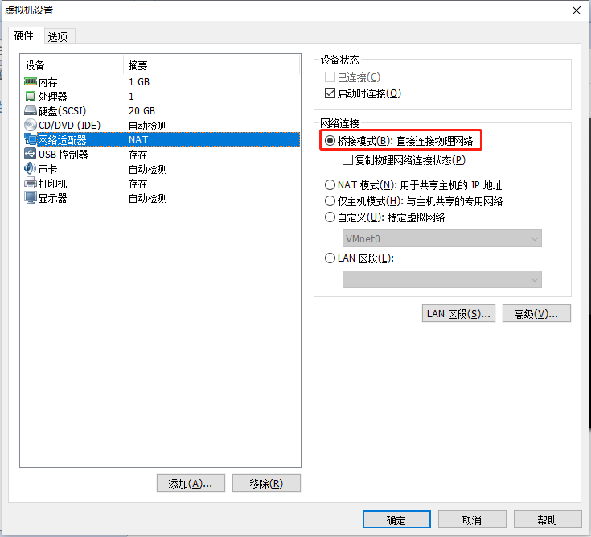
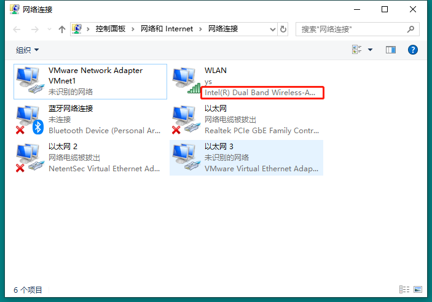

# 安装系统

## 安装 VMware

## 创建虚拟机







## 安装系统

## 网络配置
打开网络配置文件：
```
vi /etc/sysconfig/network-scripts/ifcfg-ens33
```

增加：
```
ONBOOT=yes
BOOTPROTO=static
IPADDR=192.168.31.190
NETMASK=255.255.255.0
GATEWAY=192.168.31.1
DNS2=114.114.114.114
DNS2=192.168.31.1
ZONE=public
```

重启网络服务：
```
systemctl restart network.service
```

验证：
```sh
ping www.baidu.com
```

# 安装软件

## 安装 GCC

### 联网环境
如果服务器能联网，则可以使用 yum 直接安装：
```
yum install gcc-c++
```

### 离线环境
如果是离线环境，则需要手动安装相关的包以及依赖了。

先查看 CentOS 的版本号：
```
rpm -q centos-release
```

到 [这里](http://vault.centos.org/)下载对应版本号的 `CentOS-7-x86_64-DVD-version.iso` 文件。

下载完成之后，解压出来。

复制 Packages 目录下的如下文件到一个新的文件夹里：
```
cpp-4.8.5-28.el7.x86_64.rpm
kernel-headers-3.10.0-862.el7.x86_64.rpm
glibc-headers-2.17-222.el7.x86_64.rpm
glibc-devel-2.17-222.el7.x86_64.rpm
gcc-4.8.5-28.el7.x86_64.rpm
```

进入文件夹进行强制安装：
```
rpm -Uvh *.rpm –nodeps –force 
```

安装完成后查看 gcc 和 g++ 是否安装成功：
```
gcc --version
```

```
g++ version
```
## 安装 FTP

### 需求
- 在一台 CentOS 7 服务器上搭建一个 FTP 服务器。
- 创建一个专门的用户用于连接该 FTP 服务。其他用户不允许连接 FTP 服务。
- 该用户只能访问指定的目录，不能切换其他目录。

### 安装 vsftpd
安装之前，先查看是否已经安装了 vsftpd ：
```
vsftpd -v
```

使用 yum 安装：
```
yum install vsftpd
```

启停命令：
```
systemctl start|stop vsftpd
```

设置开启自启：
```
systemctl enable vsftpd
```

### 开放相关端口
vsftpd 服务默认监听的是 21 端口，我们要在防火墙里配置开放 21 端口，才能在外部客户端上连接该服务。
```
firewall-cmd --zone=public --permanent --add-port=21/tcp
firewall-cmd --zone=public --permanent --add-service=ftp
firewall-cmd --reload
```

查看是否开放成功：
```
firewall-cmd --list-all
```

### 创建 FTP 专用用户
创建一个用户，专门连接 FTP 服务：
```
useradd -m ftpuser
```
`-m` 表示自动为该用户创建同名的 home 目录。（例如本例中用户 ftpuser 的 home 目录就是 /home/ftpuser )

设置 ftpuser 的密码：
```
passwd ftpuser
```

上面创建用户的同时已经为该用户创建了一个专属的 home 目录，我们就用这个 home 目录作为该用户的 FTP 服务目录。

### 配置 FTP 服务
vsftpd 的配置文件位于 `/etc/vsftpd/vsftpd.conf` 。在编辑配置文件之前，我们通常先将原始的配置文件备份一份，以防将来还原。
```
cp /etc/vsftpd/vsftpd.conf /etc/vsftpd/vsftpd.conf.bak
```

#### 基础配置
```
# 是否允许匿名登录 FTP 服务器，默认设置为 YES 允许。这里设置为 NO，不允许匿名登录
anonymous_enable=NO

# 是否允许本地用户（即 CentOS 系统中的用户帐号）登录 FTP 服务器，默认设置为 YES 允许
local_enable=YES

# 是否允许本地用户对 FTP 服务器文件具有写权限，默认设置为 YES 允许
write_enable=YES

# 掩码，本地用户默认掩码为 077
local_umask=022

# 是否激活目录欢迎信息功能，当用户用 cmd 模式首次访问服务器上某个目录时，ftp 服务器将显示欢迎信息。默认情况下，欢迎信息是通过该目录下的 .message 文件获得的，此文件保存自定义的欢迎信息，由用户自己建立
dirmessage_enable=YES

# 是否让系统自动维护上传和下载的日志文件，默认情况该日志文件为 /var/log/vsftpd.log ，也可以通过下面的 xferlog_file 选项对其进行设定
xferlog_enable=YES

# 是否启用 FTP 数据端口 20 （21为连接控制端口）
connect_from_port_20=YES

# 是否以标准 xferlog 的格式书写传输日志文件，默认为 /var/log/xferlog ，也可以通过 xferlog_file 选项对其进行设定
xferlog_std_format=YES

# 是否允许监听。如果设置为 YES ，则 vsftpd 将以独立模式运行，由 vsftpd 自己监听和处理 IPv4 端口的连接请求
listen=NO

# 设定是否支持 IPV6 。如要同时监听 IPv4 和 IPv6 端口，则必须运行两套 vsftpd，采用两套配置文件，同时确保其中有一个监听选项是被注释掉的
listen_ipv6=YES

# 设置 PAM 外挂模块提供的认证服务所使用的配置文件名，即 /etc/pam.d/vsftpd 文件
pam_service_name=vsftpd

# 是否使用 tcp_wrappers 作为主机访问控制方式
tcp_wrappers=YES
```

#### 配置指定用户登录
```
userlist_enable=YES
userlist_deny=NO
userlist_file=/etc/vsftpd/vsftpd.userlist
```
- userlist_enable ：是否开启指定用户登录。
- userlist_deny ：配置为 YES ，表示 `/etc/vsfptd/vsftpd.userlist` 中的用户无法登录 FTP 服务器。配置为 NO ，表示只有 `/etc/vsfptd/vsftpd.userlist` 中的用户才能登录 FTP 服务器。此处配置为 NO 。
- userlist_file ：指定用户的用户名存放的文件。

将上面创建的 ftpuser 添加到 vsftpd.userlist 文件中：
```
echo 'ftpuser' | tee -a /etc/vsftpd/vsftpd.userlist
```

#### 锁定登录用户在自己的主目录内
登录用户不能自由切换目录，只能在自己的 home 目录操作。配置如下：
```
chroot_local_user=YES
allow_writeable_chroot=YES
```

### 参考
[CentOS 7 搭建ftp服务器](http://sunshiyong.com/2018/05/25/linux-ftp/)
## 安装 ngrok

### 必要条件
- 一个服务器（阿里云服务器就可以）
- 一个域名

### 准备工作
安装 git 和 golang
```
sudo apt install git golang
```

获取 ngrok 源码
```
git clone https://github.com/tutumcloud/ngrok.git
```

### 生成自签名证书
```
cd ngrok
 
NGROK_DOMAIN="ngrok.ys.cn"

openssl genrsa -out base.key 2048

openssl req -new -x509 -nodes -key base.key -days 10000 -subj "/CN=$NGROK_DOMAIN" -out base.pem

openssl genrsa -out server.key 2048

openssl req -new -key server.key -subj "/CN=$NGROK_DOMAIN" -out server.csr

openssl x509 -req -in server.csr -CA base.pem -CAkey base.key -CAcreateserial -days 10000 -out server.crt
```

执行完上述命令之后，就生成了一个签名证书 base.pem
```
ls

assets    base.pem  contrib       docs     Makefile   server.crt  server.key
base.key  base.srl  CONTRIBUTORS  LICENSE  README.md  server.csr  src
```

替换签名证书
```
cp base.pem assets/client/tls/ngrokroot.crt
```

### 编译
```
sudo make release-server release-client
```

编译成功之后会在 bin 目录生成 ngrok 和 ngrokd 
```
ls bin

go-bindata  ngrok  ngrokd
```

ngrokd 就是服务端程序，运行
```
sudo ./bin/ngrokd -tlsKey=server.key -tlsCrt=server.crt -domain="ngrok.ys.cn" -httpAddr=":83" -httpsAddr=":444"
```

### 生成客户端
Windows
```
GOOS=windows GOARCH=amd64 make release-client
```

Mac
```
GOOS=darwin GOARCH=amd64 make release-client
```

生成成功之后会在 bin 目录下生成一个 windows_amd64 目录
```
ls bin/

go-bindata  ngrok  ngrokd  windows_amd64
```

在 windows_amd64 目录中的 ngrok.exe 文件就是生成的 windows 客户端。

将 ngrok.exe 文件复制到本地，新建一个文件夹，命名为 ngrok ，将 ngrok.exe 放入该文件夹中。

同时在该文件夹中新建一个 ngrok.cfg 配置文件，加入如下配置：
```
server_addr: "ngrok.ys.cn:4443"
trust_host_root_certs: false
```

### 运行客户端
打开 cmd ，进入 ngrok 目录，运行命令
```
ngrok.exe -config=ngrok.cfg -log=ngrok.log -subdomain=wx 8080
```

看到如下日志表示连接成功
```
Tunnel Status                 online
Version                       1.7/1.7
Forwarding                    http://wx.ngrok.ys.cn:83 -> 127.0.0.1:8080
Forwarding                    https://wx.ngrok.ys.cn:83 -> 127.0.0.1:8080
Web Interface                 127.0.0.1:4040
# Conn                        0
Avg Conn Time                 0.00ms
```

### Nginx 配置
nginx 
```
server {
        listen  80;
        server_name *.ngrok.ys.cn;

        #root   html;
        #index  index.html index.htm index.php;

        ## send request back to apache ##
        location / {
                  proxy_pass  http://127.0.0.1:83;
                #Proxy Settings
                proxy_redirect     off;
                #proxy_set_header Host downloads.openwrt.org;
                proxy_set_header   Host             $host:83;
                proxy_set_header   X-Real-IP        $remote_addr;
                proxy_set_header   X-Forwarded-For  $proxy_add_x_forwarded_for;
                proxy_next_upstream error timeout invalid_header http_500 http_502 http_503 http_504;
                proxy_max_temp_file_size 0;
                proxy_connect_timeout      90;
                proxy_send_timeout         90;
                proxy_read_timeout         90;
                proxy_buffer_size          4k;
                proxy_buffers              4 32k;
                proxy_busy_buffers_size    64k;
                proxy_temp_file_write_size 64k;
        }
}

server {
        listen 443;
        server_name *.ngrok.ys.cn;

        #ssl on;
        #ssl_certificate /etc/letsencrypt/live/shirakun.cc/fullchain.pem;
        #ssl_certificate_key /etc/letsencrypt/live/shirakun.cc/privkey.pem;
        #    access_log  logs/quancha.access.log  main;
        #    error_log  logs/quancha.error.log;
        #root   html;
        #index  index.html index.htm index.php;

        ## send request back to apache ##
        location / {
                proxy_pass  https://127.0.0.1:444;
                #Proxy Settings
                proxy_redirect     off;
                #proxy_set_header Host downloads.openwrt.org;
                proxy_set_header   Host             $host:444;
                proxy_set_header   X-Real-IP        $remote_addr;
                proxy_set_header   X-Forwarded-For  $proxy_add_x_forwarded_for;
                proxy_next_upstream error timeout invalid_header http_500 http_502 http_503 http_504;
                proxy_max_temp_file_size 0;
                proxy_connect_timeout      90;
                proxy_send_timeout         90;
                proxy_read_timeout         90;
                proxy_buffer_size          4k;
                proxy_buffers              4 32k;
                proxy_busy_buffers_size    64k;
                proxy_temp_file_write_size 64k;
        }
}

```

### 请求转发理解
|protocal|nginx|ngrok|tunnel|local|
|-|-|-|-|-|
|http|wx.ngrok.ys.cn:80|ngrok.ys.cn:83|ngrok.ys.cn:4443|127.0.0.1:8080|
|https|wx.ngrok.ys.cn:443|ngrok.ys.cn:444|ngrok.ys.cn:4443|127.0.0.1:8080|

```
request --> nginx --> ngrok --> tunnel --> local
```

### 参考
[阿里云搭建ngrok实现内网穿透](https://blog.csdn.net/qq_34292044/article/details/78559128)

[搭建自己的ngrok服务](https://tonybai.com/2015/03/14/selfhost-ngrok-service/)

## 安装 VPN

### 申请 vultr 服务器

首先从 [这里](https://www.vultr.com/) 创建一个 vultr 账户。

然后为账户充值。现在支持支付宝和微信了。

然后新建一个服务器实例。

使用命令行登录这个实例，开启 ssh 。

如果该实例的 IP 在国内被封，就删掉该实例，换个节点重新建一个实例。直达遇到 IP 没被封的实例为止。否则，远程 ssh 就连不上。

查看 IP 在国内是否被封的方法如下：

1. 点击 [这里](http://coolaf.com/tool/port) 检测国内端口是否开放。

2. 点击 [这里](https://www.yougetsignal.com/tools/open-ports/) 检测国外端口是否开放。

如果国外是开放的，国内是关闭的，证明 IP 被封了。

### 搭建 VPN

建议使用自动化脚本部署 vpn 服务。步骤如下：

下载 shadowsocks.sh 脚本：

```shell
wget --no-check-certificate -O shadowsocks.sh https://raw.githubusercontent.com/teddysun/shadowsocks_install/master/shadowsocks.sh
```

为 shadowsocks.sh 脚本添加执行权限：

```shell
chmod +x shadowsocks.sh
```

运行 shadowsocks.sh 脚本：

```shell
./shadowsocks.sh 2>&1 | tee shadowsocks.log
```

加密方式推荐选择：aes-256-gcm

### 加速插件 Kcptun
安装：
```
wget --no-check-certificate https://github.com/kuoruan/shell-scripts/raw/master/kcptun/kcptun.sh

sh kcptun.sh
```

安装后的日志：
```
恭喜! Kcptun 服务端安装成功。
服务器IP:  95.179.178.183 
端口:  29900 
加速地址:  127.0.0.1:8701 
key:  mykey
crypt:  aes 
mode:  fast3 
mtu:  1350 
sndwnd:  512 
rcvwnd:  512 
datashard:  10 
parityshard:  3 
dscp:  0 
nocomp:  false 
quiet:  false 
```

```
当前安装的 Kcptun 版本为: 20190515
请自行前往:
  https://github.com/xtaci/kcptun/releases/tag/v20190515
手动下载客户端文件
```

```
可使用的客户端配置文件为:
{
  "localaddr": ":8701",
  "remoteaddr": "95.179.178.183:29900",
  "key": "mykey",
  "crypt": "aes",
  "mode": "fast3",
  "mtu": 1350,
  "sndwnd": 512,
  "rcvwnd": 512,
  "datashard": 10,
  "parityshard": 3,
  "dscp": 0,
  "nocomp": false,
  "quiet": false
}
```

```
手机端参数可以使用:
  key=mykey;crypt=aes;mode=fast3;mtu=1350;sndwnd=512;rcvwnd=512;datashard=10;parityshard=3;dscp=0
```

```
Kcptun 安装目录: /usr/local/kcptun

已将 Supervisor 加入开机自启,
Kcptun 服务端会随 Supervisor 的启动而启动

更多使用说明: kcptun.sh help
```

### 参考
[翻墙的VPS选择与SS快速搭建与优化](https://blog.dreamtobe.cn/2016/11/30/vps-ss/)

[使用shadowsocks & kcptun手动搭建ss实现国外网上冲浪](https://blog.51cto.com/10166474/2306876)

[kcptun安装脚本](https://github.com/kuoruan/shell-scripts)

[kcptun-android客户端](https://github.com/shadowsocks/kcptun-android/releases)

[kcptun-windows客户端](https://github.com/xtaci/kcptun/releases)

# 用户管理

## 相关文件

### 概览

| 名称           | 文件路径                 |
| -------------- | ------------------------ |
| 用户信息       | /etc/passwd              |
| 影子文件       | /etc/shadow              |
| 组信息         | /etc/group               |
| 组密码文件     | /etc/gshadow             |
| 用户 home 目录 | /home/username           |
| 用户邮箱       | /var/spool/mail/username |

### /etc/passwd

```sh
cat /etc/passwd

root:x:0:0:root:/root:/bin/bash
bin:x:1:1:bin:/bin:/sbin/nologi
```

/etc/passwd 文件的内容每一行代表一个用户，中间用冒号分隔，一行共分成 7 列，每一列的含义如下：

第 1 列：用户名

第 2 列：密码（不会明文显示，用 x 代替）

第 3 列：用户 ID

- 0 ：表示管理员用户。

- 1~499 ：表示系统用户。操作系统用来运行系统服务的，不能登录。

- 500~60000 ：表示普通用户。

第 4 列：组 ID

第 5 列：用户说明

第 6 列：用户 home 目录

第 7 列：登录 shell

### /etc/shadow

```sh
cat /etc/shadow

root:$6$6F/97Dd75kORi821$V5lGbtzWdMWdUQ9h9oq2PxeRxd8U0mP4dbrYLhgjUdLlGD0uyu57sfBejj.vFVtMA8eegsMt2mckS2WEZJQlZ/::0:99999:7:::
bin:*:17834:0:99999:7:::
```

第 1 列：用户名

第 2 列：加密后的密码。如果这一列为 `!!` 或 `*` ，代表该用户没有密码，无法登录。

第 3 列：密码最近修改时间

第 4 列：两次修改密码的间隔时间

第 5 列：密码有效期

第 6 列：密码到期前的警告天数

第 7 列：密码过期后的宽限天数

第 8 列：密码失效时间

第 9 列：保留

### /etc/group

```sh
cat /etc/group

root:x:0:
bin:x:1:
```

第 1 列：组名

第 2 列：组密码

第 3 列：GID（组 ID）

第 4 列：附加组是改组的用户


初始组：每个用户都有且只有一个初始组。

附加组：每个用户可以有多个附加组。

## 用户相关命令

### 添加用户

```sh
useradd 用户名
```

示例：

```sh
useradd yangsen
```

查看相关文件：

```sh
cat /etc/passwd
yangsen:x:1002:1002::/home/yangsen:/bin/bash

cat /etc/shadow
yangsen:!!:18787:0:99999:7:::

cat /etc/group
yangsen:x:1002:

cat /etc/gshadow
yangsen:!::

ll /var/spool/mail/
yangsen

ll /home
drwx------. 2 yangsen  yangsen  62 6月   9 20:10 yangsen
```

### 设置密码

```sh
passwd 用户名
```

### 修改用户信息

```sh
usermod 用户名
```

### 删除用户

```sh
userdel 选项 用户名

选项：
-r 删除用户的同时删除用户的 home 目录
```

### 切换用户

```sh
su 选项 用户名

选项：
- 切换用户时，连带用户的环境变量一起切换，不可省略
```

## 组相关命令

### 添加组

```sh
groupadd 组名
```

### 删除组

```sh
groupdel 组名
```

### 把用户添加进组

```sh
gpasswd -a 用户名 组名
```

### 从组中删除用户

```sh
gpasswd -d 用户名 组名
```

### 改变当前用户的初始组

```sh
newgrp 组名
```

# 权限管理

# 文件系统管理

## scp

命令格式：
```
scp 源主机用户名@源主机IP:源文件 目标主机用户名@目标主机IP:目标目录 
```

复制本机文件到目标服务器：
```
scp 源文件 目标主机用户名@目标主机IP:目标目录 
```

复制目标服务器文件到本机：
```
scp 源主机用户名@源主机IP:源文件 目标目录
```

## 批量重命名文件

### rename 命令
可以使用 rename 命令来批量重命名文件。命令格式：
```
rename from to file
```
- from: 原来的文件名
- to: 修改后的文件名
- file: 要修改的文件

### 示例
#### 示例一
有一批文件，都是以 log 开头的：log001.txt ，log002.txt ，.... 一直到 log100.txt 。现在想要把这批文件的 log 全部替换为 history ：
```
rename log history log*
```

#### 示例二
将所有 jpeg 的后缀名图片文件修改为 jpg 文件：
```
rename .jpeg .jpg *.jpeg
```

## lrzsz

### lrzsz 是什么
lrzsz 是一个文件传输工具。我们使用它，可以将本地文件上传到服务器，也可以将服务器的文件下载到本地。

### 安装 lrzsz
在 CentOS 上可以直接使用 yum 安装：
```
yum -y install lrzsz 
```

### 使用
上传本地文件到服务器：
```
rz
```

下载服务器文件到本地：
```
sz 源文件
```

## 解压缩

### .zip 格式

压缩目录：
```
zip -r 压缩包名 源目录
```

解压到当前目录：
```
unzip 压缩包名
```

### .tar.gz 格式
压缩目录：
```
tar -zcvf 压缩包名 源目录
```

解压当当前目录：
```
tar -zxvf 压缩包名
```

### .tar.bz2 格式
压缩目录：
```
tar -jcvf 压缩包名 源目录
```

解压当当前目录：
```
tar -jxvf 压缩包名
```

# 服务管理

# 系统管理

# 日志管理

# 网络管理

## 网络命名空间

### 什么是网络命名空间

创建：

```sh
ip netns add 网络命名空间名称
```

查看：

```sh
ip netns
```

删除：

```sh
ip netns del ns1
```

### 和根网络命名空间连通

创建一个名为 blue 的网络命名空间：

```sh
ip netns add blue
```

创建 veth ，veth 是一对虚拟网络接口，在本例中，分别命名为 veth0 和 veth1 ：

```sh
ip link add veth0 type veth peer name veth1
```

使用 `ip addr` 命令可以查看刚刚新建的这一对虚拟网络接口：

```sh
ip addr

...
7: veth1@veth0: <BROADCAST,MULTICAST,M-DOWN> mtu 1500 qdisc noop state DOWN group default qlen 1000
    link/ether 1a:40:ea:39:ce:d5 brd ff:ff:ff:ff:ff:ff
8: veth0@veth1: <BROADCAST,MULTICAST,M-DOWN> mtu 1500 qdisc noop state DOWN group default qlen 1000
    link/ether de:f9:19:96:6f:ce brd ff:ff:ff:ff:ff:ff
```

新创建的这一对虚拟网络接口，是属于根网络命名空间的，和 eth0 一样。

下面我们将 veth1 挂到 blue 空间里去：

```sh
ip link set veth1 netns blue
```

此时在执行 `ip addr` 就可以看到 veth1 不在了：

```sh
ip addr

...
8: veth0@veth1: <BROADCAST,MULTICAST,M-DOWN> mtu 1500 qdisc noop state DOWN group default qlen 1000
    link/ether de:f9:19:96:6f:ce brd ff:ff:ff:ff:ff:ff
```

到 blue 空间中看一下网络接口：

```sh
ip netns exec blue ip addr

1: lo: <LOOPBACK> mtu 65536 qdisc noop state DOWN group default qlen 1000
    link/loopback 00:00:00:00:00:00 brd 00:00:00:00:00:00
7: veth1@if8: <BROADCAST,MULTICAST> mtu 1500 qdisc noop state DOWN group default qlen 1000
    link/ether 1a:40:ea:39:ce:d5 brd ff:ff:ff:ff:ff:ff link-netnsid 0
```

可以看到有两个网络接口：

- 一个本地回环接口 lo
- 一个 veth1

接下来就是要配置 veth1 接口。

给 veth1 分配 IP地址：

```sh
ip netns exec blue ip addr add 10.1.1.1/24 dev veth1
```

并启动 veth1 和 lo ：

```sh
ip netns exec blue ip link set veth1 up
ip netns exec blue ip link set lo up
```

再次查看 blue 空间的网络接口状态：

```sh
ip netns exec blue ip addr

1: lo: <LOOPBACK,UP,LOWER_UP> mtu 65536 qdisc noqueue state UNKNOWN group default qlen 1000
    link/loopback 00:00:00:00:00:00 brd 00:00:00:00:00:00
    inet 127.0.0.1/8 scope host lo
       valid_lft forever preferred_lft forever
    inet6 ::1/128 scope host 
       valid_lft forever preferred_lft forever
7: veth1@if8: <NO-CARRIER,BROADCAST,MULTICAST,UP> mtu 1500 qdisc noqueue state LOWERLAYERDOWN group default qlen 1000
    link/ether 1a:40:ea:39:ce:d5 brd ff:ff:ff:ff:ff:ff link-netnsid 0
    inet 10.1.1.1/24 scope global veth1
       valid_lft forever preferred_lft forever
```

可以看到，本地回环接口和 veth1 都分配了指定的 IP 并成功运行。

由于本地回环接口启动了，所以 ping 自己是可以 ping 通的，如下：

```sh
ip netns exec blue ping 10.1.1.1

PING 10.1.1.1 (10.1.1.1) 56(84) bytes of data.
64 bytes from 10.1.1.1: icmp_seq=1 ttl=64 time=0.116 ms
64 bytes from 10.1.1.1: icmp_seq=2 ttl=64 time=0.075 ms
64 bytes from 10.1.1.1: icmp_seq=3 ttl=64 time=0.079 ms
```

给 veth0 也分配一个 IP 并启动：

```sh
ip addr add 10.1.1.2/24 dev veth0
ip link set veth0 up
```

此时从 blue 空间 ping 根空间还 ping 不通。

给 veth1 配置默认路由：

```sh
ip netns exec blue ip route add default via 10.1.1.1
```

默认路由指定找不到地址的数据包都从 10.1.1.1 也即 veth1 发送出去。

查看：

```sh
ip netns exec blue ip route show

default via 10.1.1.1 dev veth1
10.1.1.0/24 dev veth1 proto kernel scope link src 10.1.1.1
```

由于 veth1 和 veth0 是一对，走 veth1 发出去的数据包会到 veth0 ，所以此时 ping 根空间就可以 ping 通了。如下：

```sh
ping 10.1.1.2

PING 10.1.1.2 (10.1.1.2) 56(84) bytes of data.
64 bytes from 10.1.1.2: icmp_seq=1 ttl=64 time=0.069 ms
64 bytes from 10.1.1.2: icmp_seq=2 ttl=64 time=0.070 ms
64 bytes from 10.1.1.2: icmp_seq=3 ttl=64 time=0.069 ms
```


### 和另一个网络命名空间连通

#### 直接相连

#### 通过 bridge 相连

#### 通过 OVS 相连

### 参考

https://www.jianshu.com/p/369e50201bce

https://www.cnblogs.com/bakari/p/10613710.html

## Network Interface(网络接口)

### 什么是网络接口

网络接口即网络设备。分为真是网络接口和虚拟的网络接口。

真实的网络接口就是计算机网卡对应的网络接口，一般为 eth0 。虚拟的网络接口如本地回环接口，名为 lo 。

可以使用 `ip addr` 命令查看主机上有哪些网络接口。

```sh
ip addr
```

```sh
1: lo: <LOOPBACK,UP,LOWER_UP> mtu 65536 qdisc noqueue state UNKNOWN group default qlen 1000
    link/loopback 00:00:00:00:00:00 brd 00:00:00:00:00:00
    inet 127.0.0.1/8 scope host lo
       valid_lft forever preferred_lft forever
    inet6 ::1/128 scope host 
       valid_lft forever preferred_lft forever
2: eth0: <BROADCAST,MULTICAST,UP,LOWER_UP> mtu 1500 qdisc mq state UP group default qlen 1000
    link/ether 56:00:02:09:1f:e4 brd ff:ff:ff:ff:ff:ff
    inet 95.179.178.183/23 brd 95.179.179.255 scope global dynamic eth0
       valid_lft 51216sec preferred_lft 51216sec
    inet6 2001:19f0:5001:59b:5400:2ff:fe09:1fe4/64 scope global mngtmpaddr dynamic 
       valid_lft 2591546sec preferred_lft 604346sec
    inet6 fe80::5400:2ff:fe09:1fe4/64 scope link 
       valid_lft forever preferred_lft forever
3: eth1: <BROADCAST,MULTICAST> mtu 1500 qdisc noop state DOWN group default qlen 1000
    link/ether 5a:00:02:09:1f:e4 brd ff:ff:ff:ff:ff:ff
4: docker0: <NO-CARRIER,BROADCAST,MULTICAST,UP> mtu 1500 qdisc noqueue state DOWN group default 
    link/ether 02:42:c3:56:01:67 brd ff:ff:ff:ff:ff:ff
    inet 172.17.0.1/16 brd 172.17.255.255 scope global docker0
       valid_lft forever preferred_lft forever
    inet6 fe80::42:c3ff:fe56:167/64 scope link 
       valid_lft forever preferred_lft forever
```

其中，eth0 是真实的网络接口，对应网卡。docker0 和 lo 都是虚拟的网络接口。

### 三大基础要素

#### IP Address

#### Gateway

#### Netmask

### 参考

https://jvns.ca/blog/2017/09/03/network-interfaces/

https://www.redhat.com/sysadmin/network-interface-linux

## 网络配置工具

### 网络配置

对 Linux 进行网络配置最终需要调用内核接口。为了方便，就出现了网络配置工具。目前市面上有两款网络配置工具：

- net-tools(已停止维护，不推荐使用)
- iproute2(推荐使用)

### net-tools

早期的网络配置工具套件称为 net-tools ，包含以下常用的工具：

- ifconfig
- route
- arp
- netstat
- ...

但 net-tools 已经停止维护，不建议使用了。

### iproute2

新出来的的网络配置工具套件叫 iproute2 。包含以下常用的工具：

- ss
- ip
- lnstat
- nstat
- rdma
- routef
- routel
- ctstat
- rtstat
- tc
- bridge
- devlink
- rtacct
- rtmon
- tipc
- arpd
- genl

### 简单对比

**查看网络接口：**

```sh
ifconfig
```

```sh
ip addr
```

**查看端口对应进程：**

```sh
$ netstat -apn|grep 3306
tcp        0      0 0.0.0.0:3306            0.0.0.0:*               LISTEN      5136/mysqld
```

```sh
$ ss -lnp |grep 3306
tcp    LISTEN     0      80        *:3306                  *:*                   users:(("mysqld",pid=5136,fd=23))
```

## 配置防火墙开放端口

**开放指定端口**

```
sudo firewall-cmd --zone=public --add-port=9/tcp --permanent
sudo firewall-cmd --reload
```

**查看防火墙规则**

```
firewall-cmd --list-all
```

# 虚拟化

# Vim

# Shell
