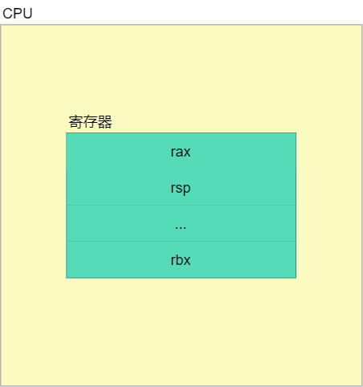
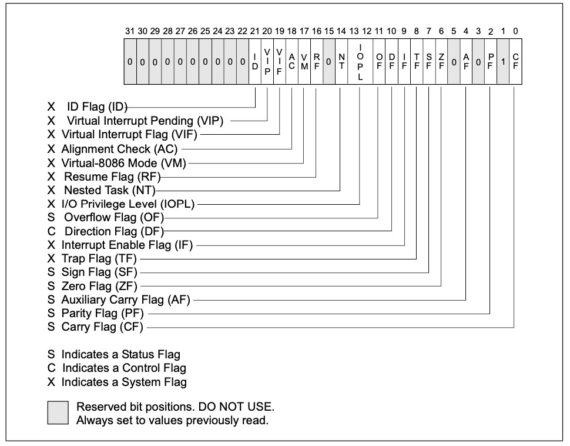

# 计算机结构

## CPU

### CPU逻辑结构

站在汇编的视角看 CPU 时，我们只需关注 CPU 的寄存器和指令集即可。下面是 CPU 的极简化的逻辑结构图：



### 寄存器

既然关注的是寄存器，下面就来列举 x86_64 位 CPU 常用的寄存器。

#### 通用寄存器

| 寄存器 | 作用 |
| ------ | ---- |
| rax    |      |
| rbx    |      |
| rcx    |      |
| rdx    |      |
| rsp    |      |
| rbp    |      |
| rsi    |      |
| rdi    |      |
| r8~r15 |      |

#### 指令寄存器

| 寄存器 | 作用                              |
| ------ | --------------------------------- |
| rip    | 存放 CPU 要执行的下一条指令的地址 |

#### 段寄存器
| 寄存器 | 作用                              |
| ------ | --------------------------------- |
| cs | 代码段 |
| ds | 数据段 |
| ss | 栈段 |
| es | 扩展段 |
| fs | 数据段 |
| gs | 数据段 |

#### 标志寄存器




#### 参考

[一口气看完45个寄存器，CPU核心技术大揭秘](https://zhuanlan.zhihu.com/p/272135463)

### 指令集

CPU 的本质能力在于执行指令，CPU 支持的指令就称为 CPU 指令集。目前主流的指令集有两种：

- Complex Instruction Set Computing (CISC) 复杂指令集，Intel 的 x86_64 CPU 使用
- Reduced Instruction Set Computing (RISC) 精简指令集，手机端的芯片使用

## 汇编语言

### 汇编语言格式

汇编语言代码最终都会被编译成 CPU 的指令。目前有两种主流的汇编语言格式：

- AT&T 格式汇编
- Intel 格式汇编

在 Linux 平台，主要使用 AT&T 格式的汇编。

### 汇编器

汇编器就是汇编语言编译器，负责将汇编代码编译成机器指令。目前 Linux 平台主流的汇编器是：

- GNU assembler

其他比较知名的汇编器有：

- NASM
- MASM

# 起步

## 系统调用 sys_exit

### 说明

**系统调用过程简述**：

- 要想触发系统调用，先需要发送 `int $0x80` 中断。
- 然后内核读取 `%eax` 里的功能码，找到对应的系统调用执行。其中参数从 `%ebx` , `%ecx` , `%edx` , `%esi` 中读取。
- 系统调用的返回值可以通过 `echo $?` 打印出来。

具体参考 [这里](https://introspelliam.github.io/2017/08/07/int-80h%E7%B3%BB%E7%BB%9F%E8%B0%83%E7%94%A8%E6%96%B9%E6%B3%95/) 。

在本例中，我们将调用一个系统调用 `sys_exit` ，该系统调用的定义如下：

```
1. sys_exit

Syntax: int sys_exit(int status)
Source: kernel/exit.c
Action: terminate the current process
Details: status is return code
```

由定义可知，该系统调用的功能码是 1 ，需要一个 status 参数，并且该参数会作为返回值返回。

### 示例

源码：

```assembly
# exit.s

.section .data # 定义数据段，本例中没有数据，所以下方没有内容

.section .text # 定义代码段
.global _start # 定义一个 symbol ，名为 _start 。symbol 的值是下面 label 对应的地址，后续可以使用 symbol d
_start:        # label ，label 对应的地址就是 symbol 的值
 movl $1, %eax  # sys_exit 系统调用的功能码是 1 ,功能码必须存入 eax 中
 movl $0, %ebx  # 传递给 sys_exit 的参数，此处使用 0 。该参数的值作为 sys_exit 的返回值返回。 
                # 返回值可以使用 echo $? 打印出来
 int $0x80      # 触发中断，唤起系统调用
```

编译：

```sh
as exit.s -o exit.o
```

链接：

```sh
ld exit.o -o exit
```

执行：

```sh
./exit
```

打印系统调用的返回值：

```sh
echo $?
```

## 寻找最大值

说明：

本例将实现需求：在一组数字中找出最大值。


# 语法

## 程序结构

程序结构：

```assembly
.section .data # 数据段
.section .text # 代码段
.global _start # 全局标号
_start: # 起始标号
... # 代码
```

