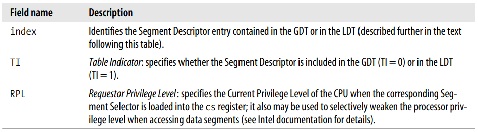
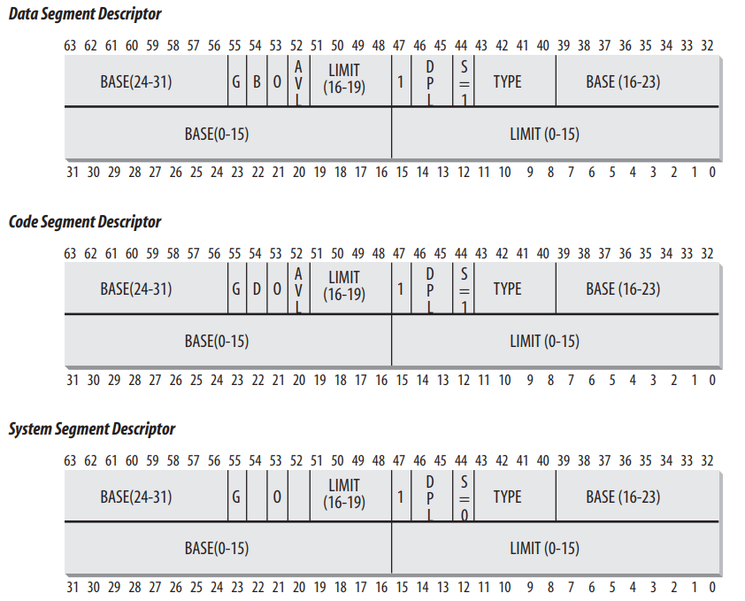
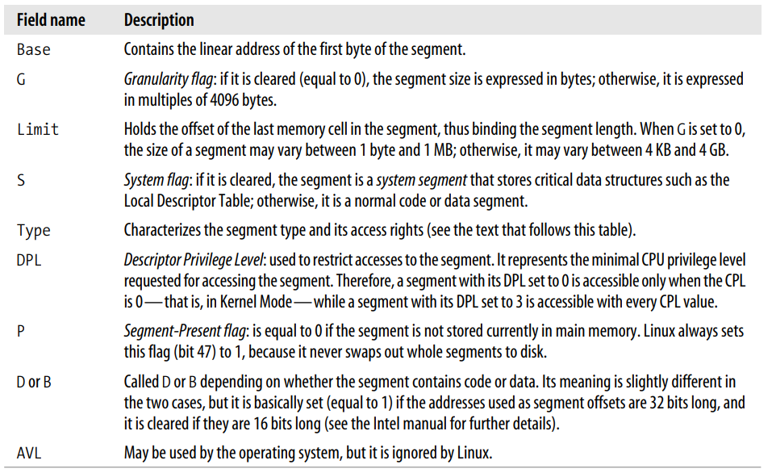
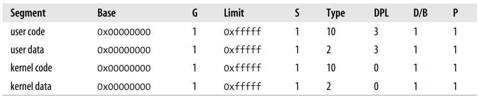
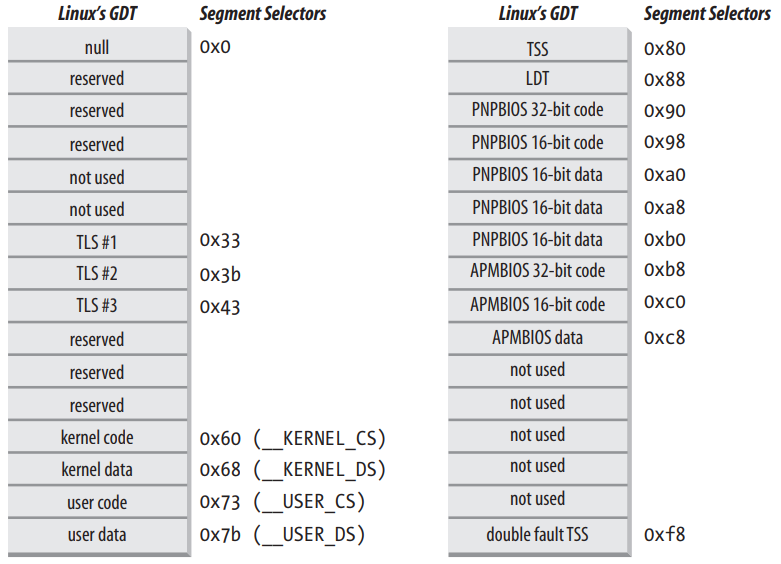

# 内存寻址

## 概述

对于 8086CPU ，有三种类型的地址：

- 逻辑地址（Logical address）：在汇编指令中出现的地址。
- 线性地址（Linear address）：又称虚拟地址。根据 CPU 的寻址能力（地址总线的宽度）计算出可寻址的内存单元个数，然后从 0 开始编号，这些编号就是线性地址。例如：一个 32 位的 CPU ，地址总线宽度是 32 ，可寻址 232 个内存单元，即最高寻址 4GB ，每个内存单元都有一个编号，用 16 进制表示就是 0x00000000 ~ 0xffffffff ，这就是线性地址。
- 物理地址（Physical address）：内存芯片为每个内存单元分配一个命中信号，这些信号就是物理地址。我们用线性地址 0x00000000 表示第一个内存单元，但是真正寻址的时候，0x00000000 要转换成对应的信号才能命中第一个内存单元。

内存管理单元（Memory Management Unit）中包含两种硬件电路：

- segmentation unit ：负责将逻辑地址转换为线性地址。
- paging unit ：负责将线性地址转换为物理地址。

如下图所示：

## CPU 中的段

### 段选择符和段寄存器

逻辑地址由两部分组成：段选择符(Segment selector) + offset

段选择符长度 16 位，存于段寄存器中。offset 长度 32 位。

段选择符结构如下：

结构说明：

CPU 提供了多种不同的段寄存器存放段选择符，用途各不相同。如下：

- cs ：代码段寄存器
- ss ：堆栈段寄存器
- ds ：数据段寄存器
- es, fs, gs ：通用段寄存器

cs 还有一个重要功能，其中的 2 位表示 CPU 当前权限级别（Current Privilege Level）。0 表示最高级别，3 表示最低级别。Linux 只用到了 0 和 3 ，分别对应内核模式和用户模式。

### 段描述符

段描述符（Segment descriptor）用来描述段的特性。长度 8 字节。存放在 GDT (Global Descriptor Table) 或 LDT (Local Descriptor Table) 中。

GDT 一般只有一个，但是每个 CPU 核心都可以有自己的 LDT 。

GDT 的结构如下：

结构说明：

GDT 的首地址和大小存放在 gdtr 寄存器中。LDT 的首地址和大小存放在 ldtr 寄存器中。

段选择符中的 3 ~ 15 位表示 index ，其实对应的是 GDT 中的 index 。所以通过段选择符中的 index ，可以找到对应的段描述符。如：段选择符中的 index 值是 2 ，GDT 的首地址是 0x00020000 ，由于 GDT 的每一个元素都是一个段描述符，长度是 8 字节，所以 对应的段描述符的地址就是 0x00020000 + (2 x 8) = 0x00020010 。

### 地址转换过程

Segmentation unit 将逻辑地址转换为线性地址的大体过程如下：

- 读取段寄存器中的内容，为获取段描述符做好准备。TI = 0 表示段描述符在 GDT 中，等于 1 表示在 LDT 中。index 对应要寻找的段描述符在 GDT 或 LDT 中的索引。
- 读取 gdtr 得到 GDT 的首地址 。
- 根据 GDT 的首地址和 index 找到段描述符的位置，读取出来，并缓存到对应的缓存寄存器中。
- 从段描述符中获取 Base 字段，即段的首地址。
- 段的首地址 + offset ，得到最终的线性地址。

如下图所示：

## Linux 中的段

### 段

8086CPU 提供了根据段寻址的机制，并提供了cs, ds, es, ss 等各种段。但是 Linux 只是有限使用了 8086CPU 提供的段功能，只使用了代码段和数据段。

Linux 定义了四个宏，对应其使用到的段选择符。分别如下：

用户模式：

- `__USER_CS__` ：代码段选择符。

- `__USER_DS__` ：数据段选择符。

内核模式：

- `__KERNEL_CS__` ：代码段选择符。

- `__KERNEL_DS__` ：数据段选择符。

四个选择符就对应有四个段描述符，如下：

可以看出，无论是用户模式还是内核模式，无论是代码段还是数据段，每一个段的起始地址都是 0x00000000 。也就是说，每一个段都独享整个内存完整的线性地址空间。这就是我们常说的，Linux 中每一个进程都独享一个完整的虚拟内存空间。

还有一个重点，Linux 中的逻辑地址和线性地址是一致的。

### GDT

寻址离不开段和 GDT ，上面讲了 Linux 是怎么使用段的，接下来分析 Linux 是怎么使用 GDT 的。

对于多核 CPU ，每个核都有一个 GDT ，这些 GDT 组成一个 GDT 表。

我们关注单个 GDT 的结构，如下：

 

从上图中可以看出 Linux 使用的四个段的段描述符的位置。

