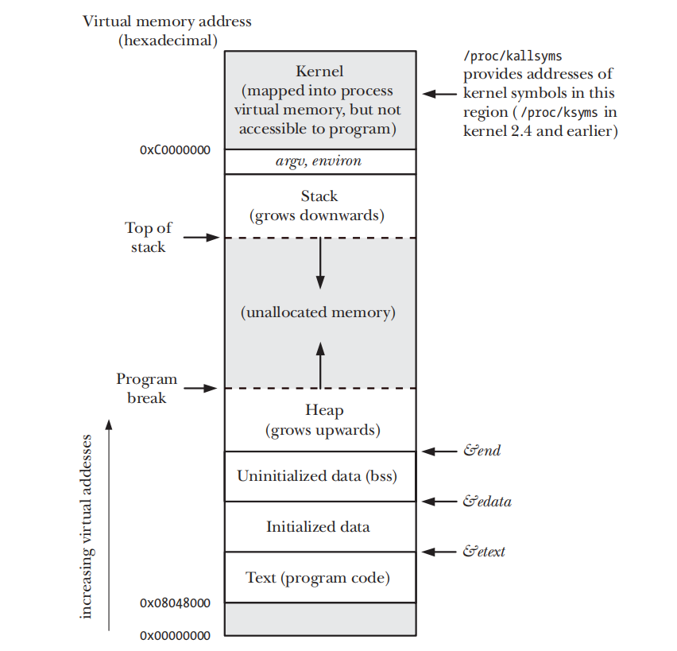

# Go汇编

## 起步

### 如何使用

Go 汇编并不是一个独立的汇编语言，它不能独立使用，必须和 Go 语言一起使用。

Go 汇编源文件也是放在 Go 包里组织的，同时 Go 包里必须有一个 Go 源文件，用以指明包信息。

在 Go 汇编源文件中定义的变量和函数，如果要放到 Go 源文件中使用，必须先在 Go 源文件中再声明一次才能使用。

### 简单示例

创建一个 Go 汇编源文件，命名为 `test_amd64.s` ，放在 test 包下。

这段汇编代码在当前包下定义了一个变量 Id ，长度为 8 字节，并初始化为 0x2537 ，十进制是 9527 。

```go
// github.com/yungsem/learn-go/go-advance/asm/03/test/test_amd64.s

#include"textflag.h"
GLOBL ·Id(SB),NOPTR,$8
DATA ·Id+0(SB)/1,$0x37
DATA ·Id+1(SB)/1,$0x25
DATA ·Id+2(SB)/1,$0x00
DATA ·Id+3(SB)/1,$0x00
DATA ·Id+4(SB)/1,$0x00
DATA ·Id+5(SB)/1,$0x00
DATA ·Id+6(SB)/1,$0x00
DATA ·Id+7(SB)/1,$0x00
```

同时，在 test 包下新建一个 Go 源文件，用于指明包信息。再次声明一下 Id 变量，以在 `main.go` 中使用：

```go
// github.com/yungsem/learn-go/go-advance/asm/03/test/test.go
package test

var Id int
```

在 `main.go` 中使用变量 Id ：

```go
// github.com/yungsem/learn-go/go-advance/asm/03/main/main.go

package main

import (
	"fmt"
	"github.com/yungsem/learn-go/go-advance/asm/03/test"
)

func main() {
	i := test.Id
	fmt.Println(i)
}

// output
9527
```
## 字面量

### 字面量（literal）
Go 汇编中的字面量以 $ 开头，有整型，浮点型，字符型和字符串型。
```
$1           // 十进制
$0xf4f8fcff  // 十六进制
$1.5         // 浮点数
$'a'         // 字符
$"abcd"      // 字符串
```
整型默认是十进制。

### 字面量表达式（literal expression）
字面量表达式也是以 $ 开头，后面跟字面量表达式。
```
$2+2      // $4
$3&1<<2   // $4
$(3&1)<<2 // $4
```
表达式中运算符的优先级和 Go 语言保持一致。

### 运行时字面量
上面说的字面量都是编译时期定义的字面量，Go 汇编也有运行时期的字面量。

比如，变量和函数的地址在运行期间都是不变的，所以变量和函数的地址也是一种字面量，不过是运行时的字面量。

```
GLOBL ·NameData(SB),$8
DATA  ·NameData(SB)/8,$"gopher"

GLOBL ·Name(SB),$16
DATA  ·Name+0(SB)/8,$·NameData(SB)
DATA  ·Name+8(SB)/8,$6
```
`$·NameData(SB)` 表示变量 NameData 的地址，也可以看作一个字面量，它在运行期间是不变的。

## 全局变量

### 概述

变量根据作用域可分为全局变量和局部变量。

Go 中的全局变量是包级别的变量，在运行期间一般有着固定的内存地址。生命周期跨越整个程序运行期间。

局部变量是在函数内部定义的变量，函数被调用时在栈上创建，函数调用完成之后就被释放了。生命周期随函数调用的结束而结束。

Go 汇编中的全局变量和函数在本质上是同一个东西，都是通过一个符号引用一段内存空间。对于变量，内存空间中存放的是数据；对于函数，内存空间中存放的是指令。

### 定义全局变量

**定义**

```
GLOBL symbol(SB),width
```

Go 汇编使用一个伪寄存器 SB 来定位内存空间。symbol(SB) 就表示符号 symbol 引用的内存空间的起始地址。

width 指定该变量占用的字节数。

**初始化**

```
DATA symbol+offset(SB)/width,value
```

offset 表示变量所引用内存空间里字节的偏移量。如：

- offset + 0 ：变量内存空间的第一个字节
- offset + 1 ：变量内存空间的第二个字节 

**示例**

定义：

```
GLOBL ·count(SB),$4
```
`·count` 前面的 `·` 表示该符号位于当前包下，最终会被替换为 `path/to/pkg.count` 。

初始化：

```
DATA ·count+0(SB)/1,$1
DATA ·count+1(SB)/1,$2
DATA ·count+2(SB)/1,$3
DATA ·count+3(SB)/1,$4
```
该示例定义了一个名为 count 的全局变量，大小 4 个字节，初始化为：

二进制：00000100 00000011 00000010 00000001

十六进制：0x04030201

十进制：67305985

### 各类型示例

#### 数组类型
```go
var num [2]int
```

```
GLOBL ·num(SB),$16
DATA ·num+0(SB)/8,$0 // 第一个元素，8 个字节，初始化为 0
DATA ·num+8(SB)/8,$0 // 第二个元素，8 个字节，初始化为 0
```

#### 布尔类型
```go
var (
    boolValue  bool
    trueValue  bool
    falseValue bool
)
```

```
GLOBL ·boolValue(SB),$1

GLOBL ·trueValue(SB),$1
DATA ·trueValue(SB)/1,$1 // 初始化为 1 ，非 0 为 true

GLOBL ·falseValue(SB),$1
DATA ·falseValue(SB)/1,$0 // 初始化为 0 ，0 为 false
```

#### int 类型
```go
var int32Value int32

var uint32Value uint32
```

```
GLOBL ·int32Value(SB),$4
DATA ·int32Value+0(SB)/1,$0x01 // 第 1 字节
DATA ·int32Value+1(SB)/1,$0x02 // 第 2 字节
DATA ·int32Value+2(SB)/2,$0x03 // 第 3-4 字节

GLOBL ·uint32Value(SB),$4
DATA ·uint32Value(SB)/4,$0x01020304 // 第1-4字节
```

#### float 类型
```go
var float32Value float32

var float64Value float64
```

```
GLOBL ·float32Value(SB),$4
DATA ·float32Value+0(SB)/4,$1.5      // var float32Value = 1.5

GLOBL ·float64Value(SB),$8
DATA ·float64Value(SB)/8,$0x01020304 // bit 方式初始化
```

#### string 类型
```go
var helloworld string
```

string 类型的底层结构：
```go
type reflect.StringHeader struct {
    Data uintptr
    Len  int
}
```

```
GLOBL text<>(SB),NOPTR,$16
DATA text<>+0(SB)/8,$"Hello Wo"
DATA text<>+8(SB)/8,$"rld!"
```

```
GLOBL ·helloworld(SB),$16
DATA ·helloworld+0(SB)/8,$text<>(SB) // StringHeader.Data
DATA ·helloworld+8(SB)/8,$12         // StringHeader.Len
```

#### slice 类型
```go
var helloworld []byte
```

slice 类型底层结构：
```go
type reflect.SliceHeader struct {
    Data uintptr
    Len  int
    Cap  int
}
```

```
GLOBL ·helloworld(SB),$24            // var helloworld []byte("Hello World!")
DATA ·helloworld+0(SB)/8,$text<>(SB) // StringHeader.Data
DATA ·helloworld+8(SB)/8,$12         // StringHeader.Len
DATA ·helloworld+16(SB)/8,$16        // StringHeader.Cap

GLOBL text<>(SB),$16
DATA text<>+0(SB)/8,$"Hello Wo"      // ...string data...
DATA text<>+8(SB)/8,$"rld!"          // ...string data...
```


#### map/channel 类型
map/channel等类型并没有公开的内部结构，它们只是一种未知类型的指针，无法直接初始化。在汇编代码中我们只能为类似变量定义并进行0值初始化：
```go
var m map[string]int

var ch chan int
```

```
GLOBL ·m(SB),$8  // var m map[string]int
DATA  ·m+0(SB)/8,$0

GLOBL ·ch(SB),$8 // var ch chan int
DATA  ·ch+0(SB)/8,$0
```

## 函数

### 定义函数

基本语法：

```
TEXT symbol(SB),[flags],$局部变量大小[-参数大小]
```

示例：

在 Go 语言中声明 Swap 函数：

```go
package main

func Swap(a, b int) (int, int)
```

汇编定义：

```assembly
TEXT ·Swap(SB), NOSPLIT, $0-32
```

注意：

1. Go 函数中的参数和返回值在 Go 汇编函数中都算作参数。所以参数的大小是参数和返回值总的大小。在本例中一共 32 字节。

2. 对于 Go 汇编函数，函数名和参数大小即是该函数的签名。所以对于上面定义的汇编函数，下面的 Go 函数声明都是有效的：

   ```go
   func Swap(a, b, c int) int
   func Swap(a, b, c, d int)
   func Swap() (a, b, c, d int)
   func Swap() (a []int, d int)
   ```

### 引用函数的参数和返回值

假设有如下函数：

```go
func Swap(a, b int) (ret0, ret1 int)
```

它对应的的汇编函数是：

```assembly
TEXT ·Swap(SB), $0-32
```

由上面我们知道，汇编函数在定义时只指定参数和返回值的总大小，并不分别指定具体某一个参数或某一个返回值。但是在汇编代码中，我们不可避免的要引用上述参数（a 和 b）和返回值（ret0 和 ret1）。那我们怎么引用呢？

Go 汇编引入了一个伪寄存器 FP ，专门用于引用函数的参数和返回值。格式如下：

```assembly
变量名/参数名+offset(FP)
```

需要注意的是，函数的参数和返回值不在本函数的栈帧中，而是由调用方函数提供的，所以在调用方函数的栈帧中。调用方在往栈中存放参数和返回值时，按照栈的生长方向（自上向下），存放的顺序是 `返回值 n` ，`返回值 n-1` ，`返回值 1` ，`参数 n` ，`参数 n-1` ，`参数 1` 。总结来说，就是先返回值倒序，然后参数倒序。

针对上述 Swap 函数，返回值和参数可以分别使用如下方式引用：

- a+0(FP)  表示参数 a
- b+8(FP)  表示参数 b
- ret0+16(FP)  表示返回值 ret0
- ret1+24(FP)  表示返回值 ret1

示意图表示如下：


### 内存对齐

Go 函数：

```go
func Foo(a bool, b int16) (c []byte)
```

汇编函数：

```assembly
TEXT ·Foo(SB), $0
    MOVEQ a+0(FP),       AX // a
    MOVEQ b+2(FP),       BX // b
    MOVEQ c_dat+8*1(FP), CX // c.Data
    MOVEQ c_len+8*2(FP), DX // c.Len
    MOVEQ c_cap+8*3(FP), DI // c.Cap
    RET
```

参数 a 和参数 b 之间出现了一个字节的空洞，b 和 c 之间出现了 4 个字节的空洞。出现空洞的原因是要保证每个参数变量地址都要对齐到相应的倍数。

### 函数的局部变量

在 Go 语言中，函数的局部变量包含：

- 参数
- 返回值
- 函数体内定义的局部变量

但是在 Go 汇编中，局部变量只包含：

- 函数体内定义的局部变量

为了方便引用局部变量，Go 汇编引入了一个伪 SP 寄存器。

SP 用于引用局部变量，引用格式如下：

```assembly
局部变量名-offset(SP)
```

局部变量本函数自己负责存放，所以存放在本函数自身的栈帧中。存放顺序也倒序。

下面用示例说明 SP 的使用：

```go
func Foo() {
    var c []byte
    var b int16
    var a bool
}
```

对局部变量 a ，b ，c 可以使用如下方式引用：


### 函数栈帧

一个完整的函数栈帧的内存结构如下：


示例：

```go
func main() {
    printsum(1, 2)
}

func printsum(a, b int) {
    var c = sum(a, b)
    println(ret)
}

func sum(a, b int) int {
    return a+b
}
```

调用栈如下：


# 调度

## 综述

### 开始

一个 Go 程序被执行：

- 操作系统创建了一个进程
- 在进程里启动了一个线程，即**主线程**
- 主线程开始执行程序的入口函数

主线程有一个用户栈和一个内核栈。我们重点关注用户栈，下面称为线程栈。

### asm_amd64.s/_rt0_amd64

主要工作：

1. 处理参数 argc 和 argv 。

2. 调用 asm_amd64.s/rt0_go 。

### asm_amd64.s/rt0_go

主要工作：

1. 栈内存对齐。
2. 初始化 g0 栈，大小约 64KB 。
3. 

## 程序启动

从程序的启动开始。

假设我们有一个 Go 编写的程序，编译后的可执行文件为 `a-go-exec` 。当我们在终端运行该程序时，执行下面的命令：

```shell
./a-go-exec
```

这背后其实做了非常复杂的事情。但是我们并不需要深入细节，只需要知道这条命令执行后：

- 操作系统创建了一个进程
- 在进程里启动了一个线程，即**主线程**
- 主线程开始执行程序的入口函数

得益于操作系统的内存管理（虚拟内存映射），每个进程都一块完整的内存空间，结构如下：



这里面有一个栈区，称为进程的**用户栈**（进程在用户态的栈）。除了用户栈，每个进程还有一个内核态的栈，叫**内核栈**。

但是线程也有自己栈，每个线程都有自己的**用户栈**和**内核栈**。不过线程的用户栈是从进程的堆区分配出来的。

我们现在只需记住线程有自己的用户栈和内核栈。

刚才我们说到，在终端运行了 `a-go-exec` 之后，创建了一个进程并启动了一个主线程。主线程有自己的用户栈和内核栈。我们有必要抽象的展示一下主线程用户栈的样子：


argc 表示命令行参数的个数，argv 表示命令行参数的值。


## 初始化 g0, m0, allp[0]

### 函数调用链

Go 程序启动的第一件事就是对调度器进行初始化。这个过程有一个很长的函数调用链，先列出来：

- _rt0_amd64
- runtime·rt0_go
  - runtime·settls
  - runtime·schedinit
    - mcommoninit
    - procresize
      - acquirep
        - wirep
      - runqempty
      - pidleput

### _rt0_amd64

#### 源码

```go
// Go 程序的入口函数
TEXT _rt0_amd64(SB),NOSPLIT,$-8
	//==============================================================
	// 处理命令行参数
	//   1.将 argc 的值存入 DI 中。
	//   2.将 argv[0] 的地址（后面用 &argv 表示）存入 SI 中。
	//   3.跳转到 runtime·rt0_go 函数。
	//==============================================================
	MOVQ	0(SP), DI	// argc
	LEAQ	8(SP), SI	// argv
	JMP	runtime·rt0_go(SB)
```

### runtime·rt0_go

#### 源码

```go
TEXT runtime·rt0_go(SB),NOSPLIT|TOPFRAME,$0
	//==============================================================
	// 调整栈，对齐内存
	//==============================================================
	// copy arguments forward on an even stack
	MOVQ	DI, AX		// argc
	MOVQ	SI, BX		// argv
	SUBQ	$(4*8+7), SP		// 2args 2auto
	ANDQ	$~15, SP
	MOVQ	AX, 16(SP)
	MOVQ	BX, 24(SP)

	//==============================================================
	// 初始化 g0 栈
	//==============================================================
	MOVQ	$runtime·g0(SB), DI
	LEAQ	(-64*1024+104)(SP), BX
	MOVQ	BX, g_stackguard0(DI)
	MOVQ	BX, g_stackguard1(DI)
	MOVQ	BX, (g_stack+stack_lo)(DI)
	MOVQ	SP, (g_stack+stack_hi)(DI)

	//==============================================================
	// 设置线程本地存储 TLS
	// 通过 get_tls 可以得到线程本地存储的值，即 m0.tls ，也即 &m0.tls[0]
	//==============================================================
	LEAQ	runtime·m0+m_tls(SB), DI
	CALL	runtime·settls(SB)

	//==============================================================
	// 验证 TLS 是否设置成功
	//==============================================================
	get_tls(BX)
	MOVQ	$0x123, g(BX)
	MOVQ	runtime·m0+m_tls(SB), AX
	CMPQ	AX, $0x123
	JEQ 2(PC)
	CALL	runtime·abort(SB)
ok:
	//==============================================================
	// 绑定 m0 和 g0
	// m0.tls[0] = &g0
	// m0.g0 = &g0
	// g0.m = &m0
	//==============================================================
	get_tls(BX)
	LEAQ	runtime·g0(SB), CX
	MOVQ	CX, g(BX)
	LEAQ	runtime·m0(SB), AX
	MOVQ	CX, m_g0(AX)
	MOVQ	AX, g_m(CX)

	//==============================================================
	// 调整栈
	//==============================================================
	MOVL	16(SP), AX		// copy argc
	MOVL	AX, 0(SP)
	MOVQ	24(SP), AX		// copy argv
	MOVQ	AX, 8(SP)
	
	//==============================================================
	// 调用 runtime·schedinit ，对调度器进行初始化
	//==============================================================
	CALL	runtime·schedinit(SB)
```

#### 栈的变化

内存对齐后：


g0栈初始化后：


设置 TLS 后，绑定 g0 和 m0 后：


再次调整 arc 和 &arv 位置后：


#### 变量的变化

```go
g0 = g{
    stack: stack{
        lo: g0栈的栈顶
        hi: g0栈的栈底
    },
    stackguard0: g0栈的栈顶,
    stackguard1: g0栈的栈顶,
    m: &m0, 
}
```

```go
m0 = m{
    g0: &g0,
    tls: []uintptr{
        &g0,
    }
}
```

### runtime·schedinit

#### 源码

```go
func schedinit() {
    //==============================================================
    // 函数 getg() 由编译器实现，获取当前正在执行的 goroutine ，
    // 在初始化时，就是 g0
    // 实际获取思路应该是当前线程（m0）从 FS 中获取
    // FS 中存储的是 m0.tls[1] 的地址，m0.tls[0] 中存放了 g0 的
    // 地址，间接可以找到 g0
	//==============================================================
	_g_ := getg()

    //==============================================================
	// 设置 sched.maxmcount
	//==============================================================
	sched.maxmcount = 10000

    //==============================================================
    // 补充初始化 m0
    // 实际传参：mcommoninit(&m0, -1)
	//==============================================================
	mcommoninit(_g_.m, -1)

	//==============================================================
    // ncpu 是一个全局变量，值等于系统核心数
    // 创建变量 procs = ncpu ，同时获取 GOMAXPROCS 环境变量的值，
    // 如果成功取到，则设置成该值
    // procs 就是接下来要创建的 p 的数量。
    // 所以 GOMAXPROCS 设置了，p 的数量就等于 GOMAXPROCS
    // 如果没有设置，p 的数量等于系统核心数（ncpu 的值）
	//==============================================================
	procs := ncpu
	if n, ok := atoi32(gogetenv("GOMAXPROCS")); ok && n > 0 {
		procs = n
    }
    
    //==============================================================
    // 调用 procresize 创建 p
	//==============================================================
	if procresize(procs) != nil {
		throw("unknown runnable goroutine during bootstrap")
	}
}
```

```go
//==============================================================
// 接收参数：(&m0, -1)
//==============================================================
func mcommoninit(mp *m, id int64) {
    //==============================================================
    // 获取当前正在运行的 g ，此时是 g0 ，即 _g_ = g0
    //==============================================================
	_g_ := getg()

    //==============================================================
    // 设置 m0.id
    // 初始化进来时，id = -1 ，所以走 else 分支，m0.id = 0
    //==============================================================
	if id >= 0 {
		mp.id = id
	} else {
		mp.id = mReserveID()
	}

    //==============================================================
    // allm 的类型是 *m
    // m0.alllink = allm
    //==============================================================
	// Add to allm so garbage collector doesn't free g->m
	// when it is just in a register or thread-local storage.
	mp.alllink = allm

    //==============================================================
    // m0.alllink -> allm
    // allm -> m0
    //
    // m1.alllink -> allm -> m0
    // allm -> m1
    // 
    // m1.alllink -> m0  m0.alllink -> allm  allm -> m1
    //==============================================================
	atomicstorep(unsafe.Pointer(&allm), unsafe.Pointer(mp))
}
```

```go
//==============================================================
// 实际传参：可能是系统核心数，也可能是 GOMAXPROCS
//==============================================================
func procresize(nprocs int32) *p {

    //==============================================================
    // old = gomaxprocs
    // gomaxprocs 是一个全局变量
    //==============================================================
	old := gomaxprocs
	if old < 0 || nprocs <= 0 {
		throw("procresize: invalid arg")
	}

    //==============================================================
	// 初始化时走的 else 分支
	// 创建 allp
	// 可以抽象的理解为 allp := make([]*p, nprocs)
    //==============================================================
	if nprocs > int32(len(allp)) {
		lock(&allpLock)
		if nprocs <= int32(cap(allp)) {
			allp = allp[:nprocs]
		} else {
			nallp := make([]*p, nprocs)
			copy(nallp, allp[:cap(allp)])
			allp = nallp
		}
		unlock(&allpLock)
	}

    //==============================================================
	// 初始化时，allp 在上面刚创建好，里面的元素都是空的
	// 这里创建 nprocs 个 p ，然后逐一放到 allp 的元素中。
    //==============================================================
	for i := old; i < nprocs; i++ {
		pp := allp[i]
		if pp == nil {
			pp = new(p)
		}
		pp.init(i)
		atomicstorep(unsafe.Pointer(&allp[i]), unsafe.Pointer(pp))
	}

    //==============================================================
    // 获取当前正在执行的 g ，初始化时是 g0
    //==============================================================
	_g_ := getg()

	//==============================================================
	// 调用 acquirep ，acquirep 调用 wirep
	// 绑定 m0 和 allp[0]
    // g0.m.p = allp[0]
    // allp[0].m = g0.m = m0
    // allp[0].status = _Prunning
    //==============================================================
	if _g_.m.p != 0 && _g_.m.p.ptr().id < nprocs {
		_g_.m.p.ptr().status = _Prunning
		_g_.m.p.ptr().mcache.prepareForSweep()
	} else {
		_g_.m.p = 0
		p := allp[0]
		p.m = 0
		p.status = _Pidle
		acquirep(p)
		if trace.enabled {
			traceGoStart()
		}
	}

	//==============================================================
	// allp[0] 不动
	// allp 中剩下的 p ，想将其状态设置为 _Pidle ，
    // 然后如果 p 的本地队列里没有待运行的 g ，
	// 则将该 p 挂到
    //==============================================================
	var runnablePs *p
	for i := nprocs - 1; i >= 0; i-- {
		p := allp[i]
		if _g_.m.p.ptr() == p {
			continue
		}
		p.status = _Pidle
		if runqempty(p) { // 初始化时走这里
			pidleput(p)
		} else {
			p.m.set(mget())
			p.link.set(runnablePs)
			runnablePs = p
		}
	}
	
	return runnablePs
}
```

```go
func acquirep(_p_ *p) {
	//==============================================================
    // 绑定 m0 和 p0
    //==============================================================
	wirep(_p_)
}
```

```go
func wirep(_p_ *p) {
    //==============================================================
    // 绑定 m0 和 p0
    // g0.m.p = p0
    // p.m = g0.m = m0
    // p.status = _Prunning
    //==============================================================
	_g_ := getg()
	_g_.m.p.set(_p_)
	_p_.m.set(_g_.m)
	_p_.status = _Prunning
}
```

```go
//==============================================================
// 判断 p 的本地队列里有没有待运行的 g 
// 如果有，返回 false ，否则返回 true
//==============================================================
// runqempty reports whether _p_ has no Gs on its local run queue.
func runqempty(_p_ *p) bool {
	for {
		head := atomic.Load(&_p_.runqhead)
		tail := atomic.Load(&_p_.runqtail)
		runnext := atomic.Loaduintptr((*uintptr)(unsafe.Pointer(&_p_.runnext)))
		if tail == atomic.Load(&_p_.runqtail) {
			return head == tail && runnext == 0
		}
	}
}
```

```go
//==============================================================
// 将空闲的 p 放到 sched 的 pidle list 中
//==============================================================
// pidleput puts p to on the _Pidle list.
func pidleput(_p_ *p) {
	assertLockHeld(&sched.lock)

	if !runqempty(_p_) {
		throw("pidleput: P has non-empty run queue")
	}
	updateTimerPMask(_p_) // clear if there are no timers.
	idlepMask.set(_p_.id)
	_p_.link = sched.pidle
	sched.pidle.set(_p_)
	atomic.Xadd(&sched.npidle, 1) // TODO: fast atomic
}
```

#### 栈的变化

绑定 m0 和  allm 后：


创建 allp 并且将 allp[0] 和 m0 绑定后：


将除 allp[0] 外所有空闲的 P 挂到 sched 的 pidle 中：


#### 变量的变化

```go
g0 = g{
    stack: stack{
        lo: g0栈的栈顶
        hi: g0栈的栈底
    },
    stackguard0: g0栈的栈顶,
    stackguard1: g0栈的栈顶,
    m: &m0, 
}
```

```go
m0 = m{
    g0: &g0,
    tls: []uintptr{
        &g0,
    },
    id: 0,
    alllink: allm, // 本次增加
    p: allp[0], // 本次增加
}
```

```go
allm = &m0 // 本次增加
```

```go
// 本次增加
sched = schedt{
    maxmcount: 10000,
    pidle: 空闲的 p
}
```

```go
// 本次增加
allp
```

```go
// 本次增加
allp[0] = &p{
    m: m0,
    status: "_Prunning"
}
```

### 小结

小结一下，这一阶段主要做了以下工作：

- 初始化 g0 ，主要初始化 g0 的栈空间，称为 g0 栈。
- 初始化 m0 的 tls 。
- 将 m0 和 g0 绑定。
- 将 m0 和 allm 绑定。
- 创建 nproc 个 p ，填入 allp 中。
- 将 allp[0] 和 m0 绑定。
- 将除 allp[0] 外所有空闲的 p 挂到 sched 的 pidle 中。

## 创建 main goroutine

### 函数调用链

### runtime·rt0_go

#### 源码

```go
// Defined as ABIInternal since it does not use the stack-based Go ABI (and
// in addition there are no calls to this entry point from Go code).
TEXT runtime·rt0_go<ABIInternal>(SB),NOSPLIT,$0
	//==============================================================
	// 上面的代码已经分析过了
	//==============================================================

	//==============================================================
	// 调用 runtime·newproc ，创建一个新的 goroutine
	// 先准备 newproc 的参数
	// 第一个参数是 0
	// 第二个参数是函数 runtime·mainPC 的地址
	// 两个参数先入栈，入栈之后调用 newproc
	//==============================================================
	// create a new goroutine to start program
	MOVQ	$runtime·mainPC(SB), AX		// entry
	PUSHQ	AX
	PUSHQ	$0			// arg size
	CALL	runtime·newproc(SB)
	POPQ	AX
	POPQ	AX

	// start this M
	CALL	runtime·mstart(SB)

	CALL	runtime·abort(SB)	// mstart should never return
	RET

	// Prevent dead-code elimination of debugCallV1, which is
	// intended to be called by debuggers.
	MOVQ	$runtime·debugCallV1<ABIInternal>(SB), AX
	RET
```

#### 栈的变化

为 newproc 准备好参数之后：


### runtime·newproc

#### 源码

```go
// src/runtime/proc.go

// Create a new g running fn with siz bytes of arguments.
// Put it on the queue of g's waiting to run.
// The compiler turns a go statement into a call to this.
//
// The stack layout of this call is unusual: it assumes that the
// arguments to pass to fn are on the stack sequentially immediately
// after &fn. Hence, they are logically part of newproc's argument
// frame, even though they don't appear in its signature (and can't
// because their types differ between call sites).
//
// This must be nosplit because this stack layout means there are
// untyped arguments in newproc's argument frame. Stack copies won't
// be able to adjust them and stack splits won't be able to copy them.
//
//go:nosplit

// 实际传过来的参数：
// siz = 0
// fn = &mainPC
func newproc(siz int32, fn *funcval) {
    // argp = &fn + 8
	argp := add(unsafe.Pointer(&fn), sys.PtrSize)
    // 获取当前的 g ，也即 g0
	gp := getg()
    // 获取返回地址，pc 为 POPQ	AX 这一句指令的地址
	pc := getcallerpc()
    // 切换到 g0 栈，执行
	systemstack(func() {
        // 执行 newproc1 ，返回一个新的 g 
        // 初始条件下，newg 就是 main goroutine
		newg := newproc1(fn, argp, siz, gp, pc)

        // _p_ = allp[0]
		_p_ := getg().m.p.ptr()
        // 将新创建的 g 转移到 allp[0] 的本地队列
		runqput(_p_, newg, true)

		if mainStarted {
			wakep()
		}
	})
}
```

### newproc1

```go
// 实际传过来的参数：
// fn = &mainPC
// argp = &fn + 8
// narg = siz
// callerpc =  POPQ	AX 这一句指令的地址
func newproc1(fn *funcval, argp unsafe.Pointer, narg int32, callergp *g, callerpc uintptr) *g {
    // g0
	_g_ := getg()

    // _p_ = allp[0]
	_p_ := _g_.m.p.ptr()
    
    // 每个 P 都有一个本地空闲队列，gFree ，里面存放着空闲的 g
	// sched.gFree 是全局空闲队列，里面也存放着空闲的 g
	// 该行尝试从 p0 的本地队列里取出一个 g ，如果本地队列为空，则从全局队列转移 32 个 g 到本地队列，并返回最后一个压入本地队列的 g
	// 如果全局队列也没有，则返回 nil
	newg := gfget(_p_)
    
    // 如果没有取到 g ，则要新建一个
	if newg == nil {
        // 新创建一个 g ，并在堆上分配 2KB 的栈空间，设置 g 的 stackguard0 ，stackguard1 和 stack 字段值
		newg = malg(_StackMin)
        // 设置 g 的状态为 _Gdead
		casgstatus(newg, _Gidle, _Gdead)
        // 将新建的 g 加入到 allg 中
		allgadd(newg)
	}
	
    // 如果要传给 runtime·mainPC(SB) 参数的 size 大于 0 
    // 初始化时 narg = 0
	if narg > 0 {
        // 将参数从 g0 栈拷贝到新建 g 的栈上
		memmove(unsafe.Pointer(spArg), argp, uintptr(narg))
	}

    // sp
	// sp 指向 newg 栈的栈顶
	sp := newg.stack.hi - totalSize
    
    // 将 newg 的 sched 的成员置为 0
	memclrNoHeapPointers(unsafe.Pointer(&newg.sched), unsafe.Sizeof(newg.sched))
    
    // 设置 newg 的 sched 的成员
	newg.sched.sp = sp
	newg.stktopsp = sp
    // 当 newg 被调度执行时，从这里设置的指令地址开始执行
    // newg.sched.pc = 函数 goexit 的地址 + 1
	// newg.sched.pc = 函数 goexit 的第二条指令 
	newg.sched.pc = funcPC(goexit) + sys.PCQuantum // +PCQuantum so that previous instruction is in same function
	newg.sched.g = guintptr(unsafe.Pointer(newg))
    
	// 调用函数 gostartcallfn
	gostartcallfn(&newg.sched, fn)

	// 将 newg 的状态置为 _Grunnable
	casgstatus(newg, _Gdead, _Grunnable)

	// 设置 newg 的 id 
	// g0 的 id 是 0
	// main gorouttine 的是 1
	// 每次新建一个 g ，就递增
	newg.goid = int64(_p_.goidcache)

	// 返回 newg
	return newg
}
```


## GPM定义

### 几个重要的全局变量

```go
var (
	m0           m
	g0           g
    sched        schedt
    
    allgs        []*g
    allm         *m
    allp         []*p
    
    gomaxprocs   int32
	ncpu         int32
    newprocs     int32
)
```

### g

```go
type g struct {
	stack       stack
	stackguard0 uintptr
	stackguard1 uintptr

	m         *m
    sched     gobuf
    goid        int64
}
```

```go
type stack struct {
	lo uintptr
	hi uintptr
}
```

```go
type gobuf struct {
	sp   uintptr
	pc   uintptr
	g    guintptr
	ctxt unsafe.Pointer
	ret  sys.Uintreg
	lr   uintptr
	bp   uintptr // for framepointer-enabled architectures
}
```

### m

```go
type m struct {
	g0      *g
	tls           [tlsSlots]uintptr
    id            int64
    alllink       *m
	p             puintptr
	nextp         puintptr
	oldp          puintptr
}
```

### p

```go
type p struct {
    m           muintptr   // back-link to associated m (nil if idle)
	status      uint32 // one of pidle/prunning/...
	
	id          int32
    
	runqhead uint32
	runqtail uint32
	runq     [256]guintptr
	runnext guintptr
}
```

### schedt

```go
type schedt struct {
	maxmcount    int32
    pidle      puintptr // idle p's
}
```


# 内存分配

# 垃圾回收

